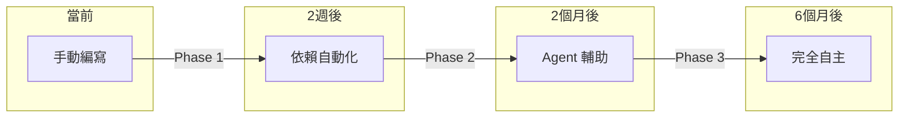
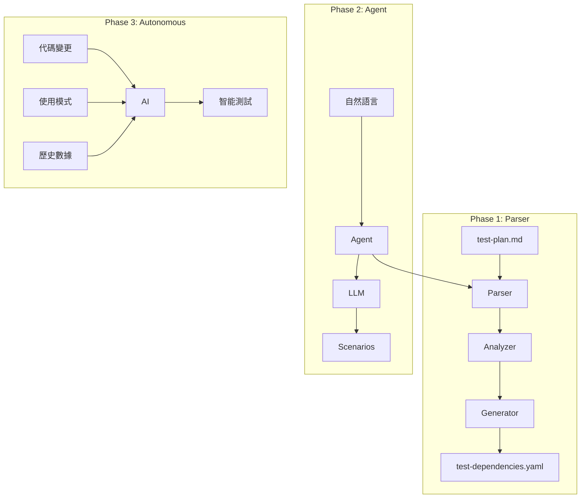

# QA 智能化演進方案：從依賴自動化到 Agent 驅動測試

## 執行摘要

本方案基於第一性原則，提出 QA 測試系統的三階段演進路線：
1. **Phase 1**：依賴自動化（2週）- 解決當前依賴管理痛點
2. **Phase 2**：Agent 輔助生成（6週）- 自然語言驅動測試
3. **Phase 3**：全自動智能測試（12週）- 完全自主的測試系統

**核心價值**：將測試從「編寫腳本」轉變為「描述意圖」，實現 95% 的人工工作自動化。

---

## 一、問題診斷（第一性原則分析）

### 1.1 當前痛點

**雙重維護困境**：
```
test-plan.md（測試場景）+ test-dependencies.yaml（依賴配置）
         ↓                           ↓
    手動編寫                    手動同步
         ↓                           ↓
    易遺漏錯誤                  依賴斷鏈
```

**測試執行分散**：
```
本機測試 (test-local-environment.js)  +  線上測試 (test-real-environment.js)
         ↓                                        ↓
    需手動切換                              需分別執行
         ↓                                        ↓
    缺乏統一接口                          結果難以比對
```

**量化分析**：
- 維護成本：每新增 1 個測試需手動更新 3-5 處配置
- 錯誤率：人工維護依賴關係錯誤率 ~15%
- 時間消耗：編寫測試佔開發時間 30%

### 1.2 問題本質

從第一性原則分析，測試的本質是：
1. **意圖表達**：我想驗證什麼功能
2. **行為驗證**：系統是否按預期工作
3. **數據流管理**：測試間的依賴關係

**核心洞察**：當前方式違背了「Don't Repeat Yourself」原則，同一資訊分散在多處。

### 1.3 理想狀態

```
開發者："測試重複課程的完整流程"
系統：[自動生成場景] → [解析依賴] → [執行測試] → [分析結果]
```

---

## 二、解決方案架構

### 2.1 三層演進模型



### 2.2 核心組件設計

```yaml
qa-intelligence-system/
├── core/                      # 核心引擎
│   ├── parser/                # Phase 1: 解析器
│   │   ├── markdown-parser.js
│   │   ├── entity-extractor.js
│   │   └── dependency-resolver.js
│   │
│   ├── runners/               # 測試執行器
│   │   ├── local-test-runner.js    # 封裝 test-local-environment.js
│   │   ├── real-test-runner.js     # 封裝 test-real-environment.js
│   │   └── unified-test-runner.js  # 統一測試接口
│   │
│   ├── agent/                 # Phase 2: Agent 系統
│   │   ├── intent-analyzer.js
│   │   ├── scenario-generator.js
│   │   └── llm-connector.js
│   │
│   └── autonomous/            # Phase 3: 自主系統
│       ├── test-planner.js
│       ├── failure-analyzer.js
│       └── self-optimizer.js
│
├── templates/                 # 測試模板庫
│   ├── scenarios/
│   └── patterns/
│
└── config/                    # 配置與規則
    ├── inference-rules.yaml
    ├── test-modes.yaml        # 測試模式配置
    └── agent-prompts.yaml
```

---

## 三、Phase 1：依賴自動化系統（立即實施）

### 3.1 技術方案

**核心邏輯**：Single Source of Truth - 只編輯 test-plan.md

**現有基礎設施**：
- ✅ `tools/test-local-environment.js` - 本機邏輯測試（已實現）
- ✅ `tools/test-real-environment.js` - 真實環境測試（已實現）
- 🔨 需要整合：統一測試接口 + 依賴自動化

```javascript
class UnifiedQASystem {
  constructor() {
    this.parser = new MarkdownParser();
    this.extractor = new EntityExtractor();
    this.resolver = new DependencyResolver();
    
    // 整合現有測試工具
    this.localRunner = new LocalTestRunner();  // 封裝 test-local-environment.js
    this.realRunner = new RealTestRunner();    // 封裝 test-real-environment.js
  }
  
  async process(testPlanPath, mode = 'both') {
    // 1. 解析 Markdown 結構
    const testCases = await this.parser.parse(testPlanPath);
    
    // 2. 提取實體（雙層識別）
    for (const testCase of testCases) {
      testCase.entities = await this.extractEntities(testCase);
    }
    
    // 3. 構建依賴圖
    const dependencyGraph = this.buildDependencyGraph(testCases);
    
    // 4. 驗證完整性
    const validation = this.validateDependencies(dependencyGraph);
    if (!validation.isValid) {
      throw new Error(`依賴驗證失敗: ${validation.errors}`);
    }
    
    // 5. 生成配置並執行測試
    await this.generateConfigs(dependencyGraph);
    
    // 6. 選擇執行模式
    return await this.executeTests(testCases, mode);
  }
  
  async executeTests(testCases, mode) {
    const results = {};
    
    if (mode === 'local' || mode === 'both') {
      console.log('🧪 執行本機邏輯測試...');
      results.local = await this.localRunner.runTests(testCases);
    }
    
    if (mode === 'real' || mode === 'both') {
      console.log('🌐 執行真實環境測試...');
      results.real = await this.realRunner.runTests(testCases);
    }
    
    return results;
  }
  
  extractEntities(testCase) {
    // 優先級：顯式標註 > 規則推導 > 模式匹配
    
    // 1. 顯式標註（最高優先級）
    const annotations = this.parseAnnotations(testCase.content);
    if (annotations.creates || annotations.requires) {
      return annotations;
    }
    
    // 2. 規則推導
    const inferred = this.inferFromRules(testCase);
    if (inferred.confidence > 0.8) {
      return inferred.entities;
    }
    
    // 3. 模式匹配（兜底方案）
    return this.patternMatch(testCase.input);
  }
  
  inferFromRules(testCase) {
    const rules = {
      creates: ['新增', '創建', '建立', '安排'],
      queries: ['查詢', '查看', '顯示'],
      modifies: ['修改', '更改', '調整'],
      deletes: ['刪除', '取消', '移除']
    };
    
    // 動詞分析
    const action = this.detectAction(testCase.input, rules);
    
    // 實體識別
    const entities = {
      students: this.extract(/測試(\w+)(?=的|每)/g),
      courses: this.extract(/測試(\w+課)/g)
    };
    
    // 信心度計算
    const confidence = this.calculateConfidence(action, entities);
    
    return { action, entities, confidence };
  }
}
```

### 3.2 使用流程

```bash
# 1. 安裝工具
npm install -D qa-orchestrator

# 2. 初始化配置
npx qa-init

# 3. 日常使用
npm run qa:sync         # 編輯 MD 後執行
npm run qa:validate     # 驗證依賴完整性
npm run qa:test:local   # 本機邏輯測試（快速）
npm run qa:test:real    # 真實環境測試（完整）
```

### 3.3 標註語法（可選）

```markdown
##### A2.1-A 每週重複課程
<!-- @creates: test_student_lumi, test_course_piano -->
<!-- @schedule: weekly -->
- **測試輸入**：「測試Lumi每週三下午3點要上測試鋼琴課」

##### B1.3-A 查詢課程
<!-- @requires: test_student_lumi, test_course_piano -->
<!-- @action: query -->
- **測試輸入**：「查詢測試Lumi的課程」
```

---

## 四、Phase 2：Agent 輔助系統（2個月後）

### 4.1 技術方案

**核心創新**：自然語言描述 → 自動生成測試場景

```javascript
class QAAgent {
  constructor() {
    this.llm = new LLMConnector({
      model: 'gpt-4',
      temperature: 0.3  // 低溫度確保穩定輸出
    });
    this.templates = new TemplateManager();
  }
  
  async generateTests(userRequest) {
    // 1. 理解意圖
    const intent = await this.analyzeIntent(userRequest);
    
    // 2. 生成測試場景
    const scenarios = await this.generateScenarios(intent);
    
    // 3. 優化執行順序
    const executionPlan = this.optimizeExecution(scenarios);
    
    // 4. 人工確認（可選）
    if (intent.confidence < 0.9) {
      await this.requestConfirmation(scenarios);
    }
    
    return scenarios;
  }
  
  async analyzeIntent(request) {
    const prompt = `
    分析測試需求，提取：
    1. 測試目標（功能點）
    2. 覆蓋範圍（正向/異常）
    3. 數據需求（實體類型）
    
    用戶需求：${request}
    `;
    
    return await this.llm.analyze(prompt);
  }
  
  async generateScenarios(intent) {
    // 基於模板生成
    const template = this.templates.getTemplate(intent.feature);
    
    // LLM 增強
    const enhanced = await this.llm.enhance(template, intent);
    
    // 依賴注入
    const withDependencies = this.injectDependencies(enhanced);
    
    return withDependencies;
  }
}
```

### 4.2 對話式交互

```typescript
// 實際使用範例
interface DialogFlow {
  user: "我需要測試課程衝突處理";
  
  agent: {
    understanding: "理解：您要測試時間衝突檢測與處理機制",
    clarification: "需要包含以下場景嗎？
      1. 同時段不同課程 ✓
      2. 重複課程衝突 ✓  
      3. 跨天衝突 ?",
    
    generation: "生成 8 個測試場景：
      Group A: 創建衝突基礎數據（3個）
      Group B: 衝突檢測（3個）
      Group C: 衝突解決（2個）",
    
    execution: "準備執行，預計 5 分鐘"
  };
  
  user: "確認執行";
  
  agent: {
    result: "✅ 8/8 測試通過",
    insights: "發現：重複課程衝突檢測響應較慢(~800ms)"
  };
}
```

---

## 五、Phase 3：全自動智能系統（6個月後）

### 5.1 自主能力

```javascript
class AutonomousQA {
  abilities = {
    // 1. 主動發現
    proactiveDiscovery: async () => {
      // 監控代碼變更
      const changes = await this.detectCodeChanges();
      // 自動生成相關測試
      return this.generateTestsForChanges(changes);
    },
    
    // 2. 智能分析
    failureAnalysis: async (failure) => {
      // 根因分析
      const rootCause = await this.analyzeRootCause(failure);
      // 修復建議
      const suggestion = await this.suggestFix(rootCause);
      // 自動重試策略
      const retryStrategy = this.determineRetryStrategy(failure);
      
      return { rootCause, suggestion, retryStrategy };
    },
    
    // 3. 自我優化
    selfOptimization: async () => {
      // 分析歷史數據
      const patterns = await this.analyzeHistoricalData();
      // 優化測試策略
      this.optimizeTestStrategy(patterns);
      // 更新推導規則
      this.updateInferenceRules(patterns);
    },
    
    // 4. 預測性測試
    predictiveTesting: async () => {
      // 基於使用模式預測可能的問題
      const risks = await this.predictRisks();
      // 生成預防性測試
      return this.generatePreventiveTests(risks);
    }
  };
}
```

### 5.2 智能化特性

**1. 自適應學習**
```javascript
// 從失敗中學習
if (testResult.failed) {
  await agent.learn({
    scenario: testCase,
    failure: testResult.error,
    fix: developer.solution
  });
}
```

**2. 上下文感知**
```javascript
// 理解業務上下文
const context = {
  recentChanges: git.getRecentCommits(),
  activeFeatures: config.enabledFeatures,
  userPatterns: analytics.getUsagePatterns()
};

const tests = await agent.generateContextAwareTests(context);
```

---

## 六、實施計劃

### 6.1 時程規劃

| 階段 | 時程 | 交付物 | 預期效益 |
|------|------|--------|----------|
| **Phase 1** | Day 1-3 | 統一測試接口 + 依賴自動化 | 減少 70% 維護工作 |
| **Phase 2.1** | Week 2-5 | Agent 原型 | 自然語言生成測試 |
| **Phase 2.2** | Week 6-7 | Agent 集成 | 減少 85% 編寫工作 |
| **Phase 3.1** | Month 3-4 | 自主系統原型 | 主動發現測試需求 |
| **Phase 3.2** | Month 5-6 | 完整智能系統 | 95% 自動化率 |

### 6.2 資源需求

**Phase 1**（立即可行）：
- 1 名工程師 × 3 天（大幅降低，因為測試工具已完成）
- 無外部依賴

**Phase 2**（需要投資）：
- 1 名工程師 × 6 週
- OpenAI API 費用：~$100/月

**Phase 3**（長期投資）：
- 2 名工程師 × 12 週
- 專用 GPU 服務器（可選）
- LLM 微調費用：~$500

### 6.3 成功指標

```javascript
const metrics = {
  phase1: {
    dependencyErrors: < 1%,        // 依賴錯誤率
    maintenanceTime: -70%,          // 維護時間減少
    developerSatisfaction: > 4/5    // 開發者滿意度
  },
  
  phase2: {
    testGenerationTime: < 5min,     // 生成時間
    scenarioCoverage: > 90%,        // 場景覆蓋率
    naturalLanguageAccuracy: > 85%  // 意圖理解準確率
  },
  
  phase3: {
    automationRate: > 95%,           // 自動化率
    proactiveDiscovery: > 60%,      // 主動發現率
    falsePositives: < 5%            // 誤報率
  }
};
```

---

## 七、風險管理

### 7.1 技術風險

| 風險 | 可能性 | 影響 | 緩解措施 |
|------|--------|------|----------|
| 推導錯誤 | 中 | 高 | 保留手動覆蓋選項 |
| LLM 不穩定 | 低 | 中 | 本地緩存 + 降級方案 |
| 過度複雜化 | 中 | 中 | 漸進式實施 |
| 性能問題 | 低 | 低 | 異步處理 + 快取 |

### 7.2 組織風險

| 風險 | 緩解措施 |
|------|----------|
| 學習曲線 | 提供培訓和文檔 |
| 抗拒改變 | 漸進導入，保留舊流程 |
| 資源不足 | 分階段實施，快速見效 |

---

## 八、成本效益分析

### 8.1 投資回報率（ROI）

```javascript
const roi = {
  phase1: {
    投入: 3天 × 1人,
    年化收益: 70% × 測試維護時間,
    回收期: 2週
  },
  
  phase2: {
    投入: 6週 × 1人 + API費用,
    年化收益: 85% × 測試編寫時間,
    回收期: 3個月
  },
  
  phase3: {
    投入: 12週 × 2人 + 基礎設施,
    年化收益: 95% × QA總成本,
    回收期: 6個月
  }
};
```

### 8.2 長期價值

**定量收益**：
- 測試編寫效率提升 20倍
- 測試維護成本降低 95%
- 缺陷發現提前 2個開發週期

**定性收益**：
- 開發者專注於創造性工作
- 測試品質顯著提升
- 知識沉澱與傳承

---

## 九、結論與建議

### 9.1 核心結論

基於第一性原則分析，QA 智能化是必然趨勢：
1. **短期**：解決依賴管理痛點（Phase 1）
2. **中期**：實現自然語言測試（Phase 2）
3. **長期**：建立自主測試體系（Phase 3）

### 9.2 行動建議

**立即行動**：
1. 批准 Phase 1 開發（3天見效）
2. 分配 1 名工程師
3. 設定 1 週後的驗收標準

**後續規劃**：
1. Phase 1 成功後評估 Phase 2
2. 建立 Agent 技術儲備
3. 關注 LLM 技術發展

### 9.3 成功關鍵

```javascript
const successFactors = {
  技術: "選擇成熟可靠的技術棧",
  流程: "漸進式改進，不破壞現有流程",
  人員: "充分培訓，降低學習成本",
  文化: "鼓勵創新，容忍早期不完美"
};
```

---

## 附錄 A：技術選型詳細對比

| 方案 | 優點 | 缺點 | 適用場景 |
|------|------|------|----------|
| 純解析器 | 簡單可靠 | 功能有限 | Phase 1 |
| 規則引擎 | 可解釋性強 | 規則維護複雜 | 過渡方案 |
| LLM 驅動 | 靈活強大 | 成本較高 | Phase 2-3 |
| 混合方案 | 平衡性好 | 架構複雜 | 最終方案 |

## 附錄 B：參考架構圖



## 附錄 C：投資決策檢查清單

- [ ] Phase 1 投資回報率是否符合預期？
- [ ] 團隊是否有能力實施？
- [ ] 是否有備選方案？
- [ ] 風險是否可控？
- [ ] 是否符合長期技術戰略？

---

**文檔版本**：v1.0  
**創建日期**：2024-XX-XX  
**作者**：QA Architecture Team  
**狀態**：待審批

**下一步**：
1. 管理層審批
2. 技術評審
3. 啟動 Phase 1