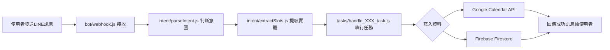

# Developer Guide

歡迎來到 LINE 課程管理機器人專案！這份指南將幫助你快速理解系統架構和開發流程。

## 1. 系統總覽與模組分工

### 核心理念
我們借用 Google Calendar 處理複雜的時間邏輯（重複規則、衝突檢測），用 Firebase 儲存業務資料。兩者分工明確，不重複造輪子。

### 模組架構
```
LINE Bot → 意圖識別 → 實體提取 → 任務執行 → 資料儲存
   ↑                                          ↓
   └────────────── 回覆結果 ←─────────────────┘
```

## 2. 使用流程：從 LINE 訊息到資料寫入的全流程圖



### 實際範例流程
```
使用者：「小明每週三下午3點數學課」
↓
意圖識別：add_course (新增課程)
↓
實體提取：{studentName: "小明", scheduleTime: "15:00", courseName: "數學課", recurring: true}
↓
執行任務：
  1. 查詢 Firebase 找到小明的 calendarId
  2. 呼叫 Google Calendar API 建立重複事件
  3. 將課程資訊存入 Firebase /courses
↓
回覆：「✅ 小明每週三下午3:00的數學課已安排好了」
```

## 3. 各模組說明

### 📁 `/bot/` - LINE Webhook 處理層
**主要檔案**：`webhook.js`
**進入點函式**：`handleWebhook(req, res)`

```javascript
// 核心邏輯
async function handleWebhook(req, res) {
  const events = req.body.events;
  for (const event of events) {
    if (event.type === 'message' && event.message.type === 'text') {
      const userMessage = event.message.text;
      const userId = event.source.userId;
      
      // 呼叫意圖識別
      const intent = await parseIntent(userMessage);
      // 提取實體
      const slots = await extractSlots(userMessage, intent);
      // 執行對應任務
      const result = await executeTask(intent, slots, userId);
      // 回覆LINE訊息
      await replyMessage(event.replyToken, result.message);
    }
  }
}
```

### 📁 `/intent/` - 語意分析層
**主要檔案**：
- `parseIntent.js` - 判斷使用者意圖
- `extractSlots.js` - 提取關鍵資訊

**parseIntent 運作流程**：
1. 先檢查 `/config/mvp/intent-rules.yaml` 的關鍵詞規則
2. 如果無法判斷，才呼叫 OpenAI API
3. 回傳意圖類型（如：add_course、query_schedule）

**extractSlots 運作流程**：
1. 根據意圖類型，決定要提取哪些欄位
2. 使用 OpenAI API 進行自然語言處理
3. 回傳結構化資料（slots map）

### 📁 `/tasks/` - 任務執行層
**命名規則**：`handle_[intent]_task.js`
**共同介面**：
```javascript
async function handle_XXX_task(slots, userId) {
  // 執行業務邏輯
  return { success: boolean, message: string };
}
```

**主要任務函式**：
- `handle_add_course_task.js` - 新增課程
- `handle_query_schedule_task.js` - 查詢課表
- `handle_set_reminder_task.js` - 設定提醒
- `handle_cancel_course_task.js` - 取消課程
- `handle_record_content_task.js` - 記錄課程內容

### 📁 `/services/` - 核心服務層
**主要服務**：
- `googleCalendarService.js` - Google Calendar API 封裝
  - `createCalendarEvent()` - 建立事件
  - `updateCalendarEvent()` - 更新事件
  - `deleteCalendarEvent()` - 刪除事件
  - `getCalendarEvents()` - 查詢事件

- `firebaseService.js` - Firebase 資料存取
  - `saveCourse()` - 儲存課程資料
  - `getCoursesByStudent()` - 查詢學生課程
  - `updateCourseRecord()` - 更新課程記錄

- `semanticService.js` - AI 語意分析服務
  - OpenAI API 呼叫封裝

## 4. 資料流說明

### 新增課程的資料流
```
1. LINE訊息「小明週三下午3點數學課」
   ↓
2. 提取資料：
   - studentName: "小明"
   - scheduleTime: "15:00"
   - courseName: "數學課"
   - recurring: true (每週)
   ↓
3. 查詢 Firebase /parents/{userId}/students
   找到小明的 calendarId
   ↓
4. 呼叫 Google Calendar API
   建立重複事件，取得 eventId
   ↓
5. 儲存到 Firebase /courses/{courseId}
   包含 eventId 關聯
   ↓
6. 回覆成功訊息給使用者
```

### 提醒任務的流程
```
Firebase Scheduled Functions (每5分鐘執行)
   ↓
查詢 Firebase /reminders
where executed == false
and triggerTime <= 現在時間
   ↓
對每筆符合的提醒
   ↓
使用 LINE Push API
推送提醒給對應的 userId
   ↓
標記提醒為已執行 (executed: true)
```

## 5. 範例任務拆解

### 📌 `add_course` 新增課程
**觸發語句範例**：
- 「小明每週三下午3點數學課」
- 「幫我安排Lumi星期五的鋼琴課」
- 「小光明天要上英文課」

**必要 slots**：
```javascript
{
  studentName: "小明",      // 必填
  courseName: "數學課",     // 必填
  scheduleTime: "15:00",    // 必填，統一轉為24小時制
  courseDate: "2025-01-15", // 單次課程必填
  recurring: true,          // 是否重複
  dayOfWeek: 3              // 重複課程的星期幾
}
```

**執行流程**：
```javascript
async function handle_add_course_task(slots, userId) {
  // 1. 查找學生的 calendarId
  const student = await firebaseService.getStudent(userId, slots.studentName);
  
  // 2. 建立 Google Calendar 事件
  const event = {
    summary: slots.courseName,
    start: { dateTime: buildDateTime(slots) },
    end: { dateTime: addOneHour(buildDateTime(slots)) },
    recurrence: slots.recurring ? [`RRULE:FREQ=WEEKLY;BYDAY=${dayMapping[slots.dayOfWeek]}`] : []
  };
  const calendarEvent = await googleCalendarService.createEvent(student.calendarId, event);
  
  // 3. 儲存到 Firebase
  await firebaseService.saveCourse({
    ...slots,
    userId,
    calendarEventId: calendarEvent.id,
    createdAt: new Date()
  });
  
  return {
    success: true,
    message: `✅ ${slots.studentName}的${slots.courseName}已安排好了`
  };
}
```

### 📌 `set_reminder` 設定提醒
**觸發語句範例**：
- 「提醒我小明的數學課」
- 「鋼琴課前一小時通知我」
- 「幫我設定提醒，記得帶琴譜」

**必要 slots**：
```javascript
{
  studentName: "小明",           // 必填
  courseName: "數學課",          // 必填（或 courseId）
  reminderTime: 30,             // 提前幾分鐘提醒（預設30）
  reminderNote: "記得帶課本"     // 選填，附加提醒內容
}
```

**執行流程**：
```javascript
async function handle_set_reminder_task(slots, userId) {
  // 1. 查找對應的課程
  const course = await firebaseService.findCourse(userId, slots.studentName, slots.courseName);
  
  // 2. 計算提醒觸發時間
  const courseDateTime = new Date(`${course.courseDate}T${course.scheduleTime}:00+08:00`);
  const reminderTime = slots.reminderTime || 30;
  const triggerTime = new Date(courseDateTime.getTime() - reminderTime * 60000);
  
  // 3. 創建提醒記錄
  await firebaseService.createReminder({
    courseId: course.courseId,
    userId,
    studentName: slots.studentName,
    courseName: slots.courseName,
    reminderTime,
    reminderNote: slots.reminderNote || null,
    triggerTime,
    executed: false
  });
  
  return {
    success: true,
    message: `✅ 將在課程開始前${reminderTime}分鐘提醒您`
  };
}
```

## 6. 常用資料格式

### Slots Map 範例
```json
{
  "studentName": "小明",
  "courseName": "數學課",
  "scheduleTime": "15:00",
  "courseDate": "2025-01-15",
  "recurring": true,
  "dayOfWeek": 3,
  "reminderNote": "記得帶課本"
}
```

### Firebase `/courses` 資料結構
```json
{
  "courseId": "auto-generated-id",
  "userId": "Uxxxxxxx",
  "studentName": "小明",
  "courseName": "數學課",
  "courseDate": "2025-01-15",
  "scheduleTime": "15:00",
  "calendarEventId": "google-event-id",
  "isRecurring": true,
  "courseRecord": {
    "notes": "今天學了分數加減法",
    "photos": ["https://storage.url/photo1.jpg"],
    "updatedAt": "2025-01-15T16:00:00Z"
  },
  "createdAt": "2025-01-10T10:00:00Z"
}
```

### Firebase `/reminders` 資料結構
```json
{
  "reminderId": "auto-generated-id",
  "courseId": "課程ID",
  "userId": "Uxxxxxxx",
  "studentName": "小明",
  "courseName": "數學課",
  "reminderTime": 30,
  "reminderNote": "記得帶課本",
  "triggerTime": "2025-01-15T14:30:00+08:00",
  "executed": false,
  "createdAt": "2025-01-10T10:00:00Z"
}
```

### Google Calendar Event 結構
```json
{
  "summary": "數學課",
  "description": "小明的課程",
  "start": {
    "dateTime": "2025-01-15T15:00:00+08:00",
    "timeZone": "Asia/Taipei"
  },
  "end": {
    "dateTime": "2025-01-15T16:00:00+08:00",
    "timeZone": "Asia/Taipei"
  },
  "recurrence": ["RRULE:FREQ=WEEKLY;BYDAY=WE"],
  "reminders": {
    "useDefault": false,
    "overrides": []
  }
}
```

## 快速上手提示

1. **本地開發**：
   ```bash
   npm install
   npm start
   ```

2. **測試訊息**：
   ```bash
   node tools/send-test-message.js "小明每週三下午3點數學課"
   ```

3. **查看日誌**：
   所有 API 呼叫都會記錄在 console，方便除錯

4. **常見問題**：
   - 時間統一使用 24 小時制儲存，顯示時轉換為中文格式
   - studentName + userId 是查找學生的關鍵
   - 每個 course 都會同時存在於 Google Calendar 和 Firebase

祝開發順利！如有問題請查閱 `/doc/implement.md` 的業務邏輯說明。