# Developer Guide

歡迎來到 LINE 課程管理機器人專案！這份指南將幫助你快速理解系統架構和開發流程。

## 0. 開發環境限制（必讀）⚠️

### 部署環境本質
**我們的部署環境：Render（無狀態 Serverless）**

#### 環境特性（第一性原則）
1. **無狀態**：每個 HTTP 請求可能由不同的實例處理
2. **短生命週期**：實例隨時可能被終止和重啟
3. **無持久記憶體**：程序記憶體會隨實例消失
4. **水平擴展**：多個實例同時運行，無法共享記憶體

#### ❌ 絕對不可使用的方案
- **Map() / Object**：存在記憶體中，重啟就消失
- **全域變數**：每個實例有自己的副本，無法同步
- **本地檔案系統**：檔案系統是臨時的，會被清除
- **SQLite**：需要本地檔案，不適合無狀態環境

#### ✅ 必須使用的方案
- **Redis**：短期狀態管理（對話上下文、快取）
- **Firebase Firestore**：業務資料持久化儲存
- **Firebase Storage**：檔案和圖片儲存
- **Google Calendar**：時間邏輯和排程管理

### 架構設計檢查清單
在設計任何功能前，必須確認：
- [ ] 是否需要跨請求保存狀態？
- [ ] 狀態儲存是否獨立於應用實例？
- [ ] 服務重啟後功能是否正常？
- [ ] 多實例並行時是否會有競爭條件？
- [ ] 是否有適當的錯誤處理和降級方案？

### 儲存方案選擇指南

| 類別 | 使用 Redis | 使用 Firebase Firestore | 原因 |
|------|-----------|------------------------|------|
| **對話記憶**<br>（currentFlow、expectingInput） | ✅ | ❌ | 短期狀態，30分鐘過期 |
| **Quick Reply 上下文**<br>（lastActions、pendingData） | ✅ | ❌ | 臨時互動狀態，毫秒級讀取 |
| **課程紀錄**<br>（日期、內容、老師） | ❌ | ✅ | 業務核心資料，需永久保存 |
| **圖片／影片連結** | ❌ | ✅ | 檔案元資料，關聯業務記錄 |
| **課程學習摘要週報** | ❌ | ✅ | 長期分析資料，需持久化 |
| **使用者設定**<br>（多子女、偏好） | ❌ | ✅ | 用戶個人資料，跨會話使用 |
| **語意任務歷程**<br>（Chronix Engine 長期任務狀態） | ❌ | ✅ | 任務生命週期管理 |
| **意圖識別快取**<br>（常見問句結果） | ✅ | ❌ | 效能優化，可重新計算 |

### 選擇原則
- **Redis**：會話級別、可重新計算、效能敏感
- **Firebase**：業務核心、需要查詢、跨會話使用

> ⚠️ **重要提醒**：所有涉及狀態管理的設計，都必須考慮無狀態環境的限制
>
> 詳細資訊請參考：`/doc/ENVIRONMENT.md`

## 1. 系統總覽與模組分工

### 核心理念
我們借用 Google Calendar 處理複雜的時間邏輯（重複規則、衝突檢測），用 Firebase 儲存業務資料。兩者分工明確，不重複造輪子。

### 模組架構
```
LINE Bot → 意圖識別 → 實體提取 → 任務執行 → 資料儲存
   ↑                                          ↓
   └────────────── 回覆結果 ←─────────────────┘
```

## 2. 使用流程：從 LINE 訊息到資料寫入的全流程圖

```mermaid
graph LR
    A[使用者發送LINE訊息] --> B[bot/webhook.js 接收]
    B --> C[intent/parseIntent.js 判斷意圖]
    C --> D[intent/extractSlots.js 提取實體]
    D --> E[tasks/handle_XXX_task.js 執行任務]
    E --> F{寫入資料}
    F --> G[Google Calendar API]
    F --> H[Firebase Firestore]
    G --> I[回傳成功訊息給使用者]
    H --> I
```



### 實際範例流程
```
使用者：「小明每週三下午3點數學課」
↓
意圖識別：add_course (新增課程)
↓
實體提取：{studentName: "小明", scheduleTime: "15:00", courseName: "數學課", recurring: true}
↓
執行任務：
  1. 查詢 Firebase 找到小明的 calendarId
  2. 呼叫 Google Calendar API 建立重複事件
  3. 將課程資訊存入 Firebase /courses
↓
回覆：「✅ 小明每週三下午3:00的數學課已安排好了」
```

## 3. 各模組說明

### 📁 `/bot/` - LINE Webhook 處理層
**主要檔案**：`webhook.js`
**進入點函式**：`handleWebhook(req, res)`

```javascript
// 核心邏輯
async function handleWebhook(req, res) {
  const events = req.body.events;
  for (const event of events) {
    if (event.type === 'message' && event.message.type === 'text') {
      const userMessage = event.message.text;
      const userId = event.source.userId;
      
      // 呼叫意圖識別
      const intent = await parseIntent(userMessage);
      // 提取實體
      const slots = await extractSlots(userMessage, intent);
      // 執行對應任務
      const result = await executeTask(intent, slots, userId);
      // 回覆LINE訊息
      await replyMessage(event.replyToken, result.message);
    }
  }
}
```

### 📁 `/intent/` - 語意分析層
**主要檔案**：
- `parseIntent.js` - 判斷使用者意圖
- `extractSlots.js` - 提取關鍵資訊

**parseIntent 運作流程**：
1. 先檢查 `/config/mvp/intent-rules.yaml` 的關鍵詞規則
2. 如果無法判斷，才呼叫 OpenAI API
3. 回傳意圖類型（如：add_course、query_schedule）

**extractSlots 運作流程**：
1. 根據意圖類型，決定要提取哪些欄位
2. 使用 OpenAI API 進行自然語言處理
3. 回傳結構化資料（slots map）

### 📁 `/tasks/` - 任務執行層
**命名規則**：`handle_[intent]_task.js`
**共同介面**：
```javascript
async function handle_XXX_task(slots, userId) {
  // 執行業務邏輯
  return { success: boolean, message: string };
}
```

**主要任務函式**：
- `handle_add_course_task.js` - 新增課程
- `handle_query_schedule_task.js` - 查詢課表
- `handle_set_reminder_task.js` - 設定提醒
- `handle_cancel_course_task.js` - 取消課程
- `handle_record_content_task.js` - 記錄課程內容

### 📁 `/services/` - 核心服務層
**主要服務**：
- `googleCalendarService.js` - Google Calendar API 封裝
  - `createCalendarEvent()` - 建立事件
  - `updateCalendarEvent()` - 更新事件
  - `deleteCalendarEvent()` - 刪除事件
  - `getCalendarEvents()` - 查詢事件

- `firebaseService.js` - Firebase 資料存取
  - `saveCourse()` - 儲存課程資料
  - `getCoursesByStudent()` - 查詢學生課程
  - `updateCourseRecord()` - 更新課程記錄

- `semanticService.js` - AI 語意分析服務
  - OpenAI API 呼叫封裝

## 4. 資料流說明

### 新增課程的資料流
```
1. LINE訊息「小明週三下午3點數學課」
   ↓
2. 提取資料：
   - studentName: "小明"
   - scheduleTime: "15:00"
   - courseName: "數學課"
   - recurring: true (每週)
   ↓
3. 查詢 Firebase /parents/{userId}/students
   找到小明的 calendarId
   ↓
4. 呼叫 Google Calendar API
   建立重複事件，取得 eventId
   ↓
5. 儲存到 Firebase /courses/{courseId}
   包含 eventId 關聯
   ↓
6. 回覆成功訊息給使用者
```

### 提醒任務的流程
```
Firebase Scheduled Functions (每5分鐘執行)
   ↓
查詢 Firebase /reminders
where executed == false
and triggerTime <= 現在時間
   ↓
對每筆符合的提醒
   ↓
使用 LINE Push API
推送提醒給對應的 userId
   ↓
標記提醒為已執行 (executed: true)
```

## 5. 範例任務拆解

### 📌 `add_course` 新增課程
**觸發語句範例**：
- 「小明每週三下午3點數學課」
- 「幫我安排Lumi星期五的鋼琴課」
- 「小光明天要上英文課」

**必要 slots**：
```javascript
{
  studentName: "小明",      // 必填
  courseName: "數學課",     // 必填
  scheduleTime: "15:00",    // 必填，統一轉為24小時制
  courseDate: "2025-01-15", // 單次課程必填
  recurring: true,          // 是否重複
  dayOfWeek: 3              // 重複課程的星期幾
}
```

**執行流程**：
```javascript
async function handle_add_course_task(slots, userId) {
  // 1. 查找學生的 calendarId
  const student = await firebaseService.getStudent(userId, slots.studentName);
  
  // 2. 建立 Google Calendar 事件
  const event = {
    summary: slots.courseName,
    start: { dateTime: buildDateTime(slots) },
    end: { dateTime: addOneHour(buildDateTime(slots)) },
    recurrence: slots.recurring ? [`RRULE:FREQ=WEEKLY;BYDAY=${dayMapping[slots.dayOfWeek]}`] : []
  };
  const calendarEvent = await googleCalendarService.createEvent(student.calendarId, event);
  
  // 3. 儲存到 Firebase
  await firebaseService.saveCourse({
    ...slots,
    userId,
    calendarEventId: calendarEvent.id,
    createdAt: new Date()
  });
  
  return {
    success: true,
    message: `✅ ${slots.studentName}的${slots.courseName}已安排好了`
  };
}
```

### 📌 `set_reminder` 設定提醒
**觸發語句範例**：
- 「提醒我小明的數學課」
- 「鋼琴課前一小時通知我」
- 「幫我設定提醒，記得帶琴譜」

**必要 slots**：
```javascript
{
  studentName: "小明",           // 必填
  courseName: "數學課",          // 必填（或 courseId）
  reminderTime: 30,             // 提前幾分鐘提醒（預設30）
  reminderNote: "記得帶課本"     // 選填，附加提醒內容
}
```

**執行流程**：
```javascript
async function handle_set_reminder_task(slots, userId) {
  // 1. 查找對應的課程
  const course = await firebaseService.findCourse(userId, slots.studentName, slots.courseName);
  
  // 2. 計算提醒觸發時間
  const courseDateTime = new Date(`${course.courseDate}T${course.scheduleTime}:00+08:00`);
  const reminderTime = slots.reminderTime || 30;
  const triggerTime = new Date(courseDateTime.getTime() - reminderTime * 60000);
  
  // 3. 創建提醒記錄
  await firebaseService.createReminder({
    courseId: course.courseId,
    userId,
    studentName: slots.studentName,
    courseName: slots.courseName,
    reminderTime,
    reminderNote: slots.reminderNote || null,
    triggerTime,
    executed: false
  });
  
  return {
    success: true,
    message: `✅ 將在課程開始前${reminderTime}分鐘提醒您`
  };
}
```

## 6. 常用資料格式

### Slots Map 範例
```json
{
  "studentName": "小明",
  "courseName": "數學課",
  "scheduleTime": "15:00",
  "courseDate": "2025-01-15",
  "recurring": true,
  "dayOfWeek": 3,
  "reminderNote": "記得帶課本"
}
```

### Firebase `/courses` 資料結構
```json
{
  "courseId": "auto-generated-id",
  "userId": "Uxxxxxxx",
  "studentName": "小明",
  "courseName": "數學課",
  "courseDate": "2025-01-15",
  "scheduleTime": "15:00",
  "calendarEventId": "google-event-id",
  "isRecurring": true,
  "courseRecord": {
    "notes": "今天學了分數加減法",
    "photos": ["https://storage.url/photo1.jpg"],
    "updatedAt": "2025-01-15T16:00:00Z"
  },
  "createdAt": "2025-01-10T10:00:00Z"
}
```

### Firebase `/reminders` 資料結構
```json
{
  "reminderId": "auto-generated-id",
  "courseId": "課程ID",
  "userId": "Uxxxxxxx",
  "studentName": "小明",
  "courseName": "數學課",
  "reminderTime": 30,
  "reminderNote": "記得帶課本",
  "triggerTime": "2025-01-15T14:30:00+08:00",
  "executed": false,
  "createdAt": "2025-01-10T10:00:00Z"
}
```

### Google Calendar Event 結構
```json
{
  "summary": "數學課",
  "description": "小明的課程",
  "start": {
    "dateTime": "2025-01-15T15:00:00+08:00",
    "timeZone": "Asia/Taipei"
  },
  "end": {
    "dateTime": "2025-01-15T16:00:00+08:00",
    "timeZone": "Asia/Taipei"
  },
  "recurrence": ["RRULE:FREQ=WEEKLY;BYDAY=WE"],
  "reminders": {
    "useDefault": false,
    "overrides": []
  }
}
```

## 快速上手提示

1. **本地開發**：
   ```bash
   npm install
   npm start
   ```

2. **測試訊息**：
   ```bash
   node tools/send-test-message.js "小明每週三下午3點數學課"
   ```

3. **查看日誌**：
   所有 API 呼叫都會記錄在 console，方便除錯

4. **常見問題**：
   - 時間統一使用 24 小時制儲存，顯示時轉換為中文格式
   - studentName + userId 是查找學生的關鍵
   - 每個 course 都會同時存在於 Google Calendar 和 Firebase

## 7. 系統現狀與真正的待實作功能

### ✅ **Phase 1 核心功能已完成**

#### 7.1 提醒系統 ✅ **已完全實作**
- ✅ 課前時間提醒（`handle_set_reminder_task.js`）
- ✅ Firebase Scheduled Functions（`functions/index.js`）
- ✅ LINE 推播提醒（每5分鐘檢查）
- ✅ 清理過期提醒記錄

#### 7.2 圖片處理功能 ✅ **已完全實作** 
- ✅ 接收 LINE 圖片訊息（`webhook.js`）
- ✅ 上傳至 Firebase Storage（`firebaseService.uploadImage()`）
- ✅ 自動關聯到課程記錄（`handle_record_content_task.js`）

#### 7.3 時間衝突檢測 ✅ **已完全實作並整合**
- ✅ 使用 Google Calendar API 檢測衝突（`googleCalendarService.checkConflict()`）
- ✅ 在新增課程時自動檢查（`handle_add_course_task.js`）
- ✅ 提供清楚的衝突資訊給用戶

#### 7.4 基礎任務處理 ✅ **已完全實作**
- ✅ 新增課程（支援重複規則）
- ✅ 查詢課表
- ✅ 設定提醒
- ✅ 取消課程
- ✅ 記錄課程內容（文字+圖片）

### 🚧 **真正的待實作功能**

基於現狀分析，主要的未實作功能集中在進階功能和系統改善方面：

#### 🔧 Phase 2 - 進階功能優化

**7.1 企業級對話管理（Slot Template 系統）**
- 🚧 **狀態：已規劃未實作** - Phase 2 功能，配置文件已準備
- 🚧 多輪對話狀態持久化（目前僅內存暫存）
- 🚧 Slot Template 引擎（支援動態配置）
- 🚧 對話中斷後的狀態恢復
- 🚧 企業級指標監控與分析

**實作架構已設計**：
```
/config/future/slot-template-collections.json  # Firestore 結構
/src/config/features.js                        # Feature Flag
```

**7.2 批次操作支援**
- 🚧 批次新增多個課程
- 🚧 批次修改重複課程
- 🚧 批次匯出學習報告

#### 🧪 Phase 3 - 系統品質提升

**7.3 自動化測試**
- 🚧 單元測試覆蓋（意圖識別、任務處理）
- 🚧 整合測試（Google Calendar、Firebase API）
- 🚧 端對端對話測試

**7.4 監控與可觀測性**
- 🚧 結構化日誌系統
- 🚧 API 效能監控
- 🚧 錯誤追蹤與告警
- 🚧 使用者行為分析

## 8. 開發優先級建議（基於實際現狀）

### ✅ **MVP 核心功能已完成**
系統已完成所有基礎功能：提醒系統、圖片處理、時間衝突檢測、任務處理等。

### 🔴 高優先級（短期改善）
1. **自動化測試系統** - 確保系統穩定性和重構安全
2. **對話狀態持久化** - 提升用戶體驗連續性
3. **結構化日誌系統** - 改善問題追蹤能力

### 🟡 中優先級（中期優化）
1. **批次操作功能** - 提升效率（批次新增課程等）
2. **智慧上下文推斷** - 減少用戶輸入負擔
3. **API 效能監控** - 預防性維護

### 🟢 低優先級（長期規劃）
1. **使用者行為分析** - 產品優化依據
2. **進階對話管理** - 企業級功能
3. **多租戶架構** - 商業化準備

## 9. 開發指南

### 新功能開發流程
1. **需求分析** - 確認業務價值和技術可行性
2. **設計階段** - 定義 API 介面和資料結構
3. **實作階段** - 遵循現有命名和架構規範
4. **測試階段** - 撰寫測試案例並執行
5. **部署階段** - 使用 Feature Flag 漸進式發布

### 程式碼規範提醒
- 意圖命名：`snake_case`（如 `add_course`）
- 函式命名：`handle_XXX_task()`
- 變數命名：`camelCase`
- 回傳格式：`{ success: boolean, message: string }`
- 統一用詞：student/course/scheduleTime

祝開發順利！如有問題請查閱 `/doc/implement.md` 的業務邏輯說明。