# Developer Guide

歡迎來到 LINE 課程管理機器人專案！這份指南將幫助你快速理解系統架構和開發流程。

## 0. 開發環境限制（必讀）⚠️

### 部署環境本質
**我們的部署環境：Render（無狀態 Serverless）**

#### 環境特性（第一性原則）
1. **無狀態**：每個 HTTP 請求可能由不同的實例處理
2. **短生命週期**：實例隨時可能被終止和重啟
3. **無持久記憶體**：程序記憶體會隨實例消失
4. **水平擴展**：多個實例同時運行，無法共享記憶體

#### ❌ 絕對不可使用的方案
- **Map() / Object**：存在記憶體中，重啟就消失
- **全域變數**：每個實例有自己的副本，無法同步
- **本地檔案系統**：檔案系統是臨時的，會被清除
- **SQLite**：需要本地檔案，不適合無狀態環境

#### ✅ 必須使用的方案
- **Redis**：短期狀態管理（對話上下文、快取）
- **Firebase Firestore**：業務資料持久化儲存
- **Firebase Storage**：檔案和圖片儲存
- **Google Calendar**：時間邏輯和排程管理

### 架構設計檢查清單
在設計任何功能前，必須確認：
- [ ] 是否需要跨請求保存狀態？
- [ ] 狀態儲存是否獨立於應用實例？
- [ ] 服務重啟後功能是否正常？
- [ ] 多實例並行時是否會有競爭條件？
- [ ] 是否有適當的錯誤處理和降級方案？

### 儲存方案選擇指南

| 類別 | 使用 Redis | 使用 Firebase Firestore | 原因 |
|------|-----------|------------------------|------|
| **對話記憶**<br>（currentFlow、expectingInput） | ✅ | ❌ | 短期狀態，30分鐘過期 |
| **Quick Reply 上下文**<br>（lastActions、pendingData） | ✅ | ❌ | 臨時互動狀態，毫秒級讀取 |
| **課程紀錄**<br>（日期、內容、老師） | ❌ | ✅ | 業務核心資料，需永久保存 |
| **圖片／影片連結** | ❌ | ✅ | 檔案元資料，關聯業務記錄 |
| **課程學習摘要週報** | ❌ | ✅ | 長期分析資料，需持久化 |
| **使用者設定**<br>（多子女、偏好） | ❌ | ✅ | 用戶個人資料，跨會話使用 |
| **語意任務歷程**<br>（Chronix Engine 長期任務狀態） | ❌ | ✅ | 任務生命週期管理 |
| **意圖識別快取**<br>（常見問句結果） | ✅ | ❌ | 效能優化，可重新計算 |

### 選擇原則
- **Redis**：會話級別、可重新計算、效能敏感
- **Firebase**：業務核心、需要查詢、跨會話使用

> ⚠️ **重要提醒**：所有涉及狀態管理的設計，都必須考慮無狀態環境的限制
>
> 詳細資訊請參考：`/doc/ENVIRONMENT.md`

### 對話時間窗與上下文原則（重要）

- 三種時間視窗（可配置/內建）：
  - 2 分鐘「期待輸入」超時：用於 Quick Reply/補充欄位流程，逾時清除 `expectingInput/pendingData`。
  - 約 1 分鐘「查詢會話鎖」：限定同一輪查詢的學生/時間（`QUERY_SESSION_TTL_MS`，預設 60000ms）。
  - 5 分鐘「對話記憶 TTL」：`CONVERSATION_TTL_SECONDS`（預設 300 秒），保存最近提及的學生/課名/時間等。

- 上下文補值分類原則：
  - 讀取型查詢（`query_schedule`、`query_course_content`）：不自動補 `courseName`（避免把寬查詢誤縮窄）；允許補 `studentName/時間參考`。
  - 寫入/修改型（新增/修改/取消/提醒/記錄）：僅在有明確錨點時補值（正在期待輸入，或剛完成的最近操作在短窗內），否則寧可請用戶明確說明。

- 課名正規化（查詢）：
  - 過濾採用「移除尾字『課』＋雙向包含」比對，提升「跆拳道」與「跆拳道課」的一致性。

## 1. 系統總覽與模組分工

### 核心理念
我們借用 Google Calendar 處理複雜的時間邏輯（重複規則、衝突檢測），用 Firebase 儲存業務資料。兩者分工明確，不重複造輪子。

### 模組架構
```
LINE Bot → 意圖識別 → 實體提取 → 任務執行 → 資料儲存
   ↑                                          ↓
   └────────────── 回覆結果 ←─────────────────┘
```

## 2. 使用流程：從 LINE 訊息到資料寫入的全流程圖

```mermaid
graph LR
    A[使用者發送LINE訊息] --> B[bot/webhook.js 接收]
    B --> C[intent/parseIntent.js 判斷意圖]
    C --> D[intent/extractSlots.js 提取實體]
    D --> E[tasks/handle_XXX_task.js 執行任務]
    E --> F{寫入資料}
    F --> G[Google Calendar API]
    F --> H[Firebase Firestore]
    G --> I[回傳成功訊息給使用者]
    H --> I
```



### 實際範例流程
```
使用者：「小明每週三下午3點數學課」
↓
意圖識別：add_course (新增課程)
↓
實體提取：{studentName: "小明", scheduleTime: "15:00", courseName: "數學課", recurring: true}
↓
執行任務：
  1. 查詢 Firebase 找到小明的 calendarId
  2. 呼叫 Google Calendar API 建立重複事件
  3. 將課程資訊存入 Firebase /courses
↓
回覆：「✅ 小明每週三下午3:00的數學課已安排好了」
```

## 3. 各模組說明

### 📁 `/bot/` - LINE Webhook 處理層
**主要檔案**：`webhook.js`
**進入點函式**：`handleWebhook(req, res)`

```javascript
// 核心邏輯
async function handleWebhook(req, res) {
  const events = req.body.events;
  for (const event of events) {
    if (event.type === 'message' && event.message.type === 'text') {
      const userMessage = event.message.text;
      const userId = event.source.userId;
      
      // 呼叫意圖識別
      const intent = await parseIntent(userMessage);
      // 提取實體
      const slots = await extractSlots(userMessage, intent);
      // 執行對應任務
      const result = await executeTask(intent, slots, userId);
      // 回覆LINE訊息
      await replyMessage(event.replyToken, result.message);
    }
  }
}
```

### 📁 `/intent/` - 語意分析層
**主要檔案**：
- `parseIntent.js` - 判斷使用者意圖
- `extractSlots.js` - 提取關鍵資訊

**parseIntent 運作流程**：
1. 先檢查 `/config/mvp/intent-rules.yaml` 的關鍵詞規則
2. 如果無法判斷，才呼叫 OpenAI API
3. 回傳意圖類型（如：add_course、query_schedule）

**extractSlots 運作流程**：
1. 根據意圖類型，決定要提取哪些欄位
2. 使用 OpenAI API 進行自然語言處理
3. 回傳結構化資料（slots map）

### 📁 `/tasks/` - 任務執行層
**命名規則**：`handle_[intent]_task.js`
**共同介面**：
```javascript
async function handle_XXX_task(slots, userId) {
  // 執行業務邏輯
  return { success: boolean, message: string };
}
```

**主要任務函式**：
- `handle_add_course_task.js` - 新增課程
- `handle_query_schedule_task.js` - 查詢課表
- `handle_set_reminder_task.js` - 設定提醒
- `handle_cancel_course_task.js` - 取消課程
- `handle_record_content_task.js` - 記錄課程內容

### 📁 `/services/` - 核心服務層
**主要服務**：
- `googleCalendarService.js` - Google Calendar API 封裝
  - `createCalendarEvent()` - 建立事件
  - `updateCalendarEvent()` - 更新事件
  - `deleteCalendarEvent()` - 刪除事件
  - `getCalendarEvents()` - 查詢事件

- `firebaseService.js` - Firebase 資料存取
  - `saveCourse()` - 儲存課程資料
  - `getCoursesByStudent()` - 查詢學生課程
  - `updateCourseRecord()` - 更新課程記錄

- `semanticService.js` - AI 語意分析服務
  - OpenAI API 呼叫封裝

## 4. 資料流說明

### 新增課程的資料流
```
1. LINE訊息「小明週三下午3點數學課」
   ↓
2. 提取資料：
   - studentName: "小明"
   - scheduleTime: "15:00"
   - courseName: "數學課"
   - recurring: true (每週)
   ↓
3. 查詢 Firebase /parents/{userId}/students
   找到小明的 calendarId
   ↓
4. 呼叫 Google Calendar API
   建立重複事件，取得 eventId
   ↓
5. 儲存到 Firebase /courses/{courseId}
   包含 eventId 關聯
   ↓
6. 回覆成功訊息給使用者
```

### 提醒任務的流程
```
Firebase Scheduled Functions (每5分鐘執行)
   ↓
查詢 Firebase /reminders
where executed == false
and triggerTime <= 現在時間
   ↓
對每筆符合的提醒
   ↓
使用 LINE Push API
推送提醒給對應的 userId
   ↓
標記提醒為已執行 (executed: true)
```

## 5. 範例任務拆解

### 📌 `add_course` 新增課程
**觸發語句範例**：
- 「小明每週三下午3點數學課」
- 「幫我安排Lumi星期五的鋼琴課」
- 「小光明天要上英文課」

**必要 slots**：
```javascript
{
  studentName: "小明",      // 必填
  courseName: "數學課",     // 必填
  scheduleTime: "15:00",    // 必填，統一轉為24小時制
  courseDate: "2025-01-15", // 單次課程必填
  recurring: true,          // 是否重複
  dayOfWeek: 3              // 重複課程的星期幾
}
```

**執行流程**：
```javascript
async function handle_add_course_task(slots, userId) {
  // 1. 查找學生的 calendarId
  const student = await firebaseService.getStudent(userId, slots.studentName);
  
  // 2. 建立 Google Calendar 事件
  const event = {
    summary: slots.courseName,
    start: { dateTime: buildDateTime(slots) },
    end: { dateTime: addOneHour(buildDateTime(slots)) },
    recurrence: slots.recurring ? [`RRULE:FREQ=WEEKLY;BYDAY=${dayMapping[slots.dayOfWeek]}`] : []
  };
  const calendarEvent = await googleCalendarService.createEvent(student.calendarId, event);
  
  // 3. 儲存到 Firebase
  await firebaseService.saveCourse({
    ...slots,
    userId,
    calendarEventId: calendarEvent.id,
    createdAt: new Date()
  });
  
  return {
    success: true,
    message: `✅ ${slots.studentName}的${slots.courseName}已安排好了`
  };
}
```

### 📌 `set_reminder` 設定提醒
**觸發語句範例**：
- 「提醒我小明的數學課」
- 「鋼琴課前一小時通知我」
- 「幫我設定提醒，記得帶琴譜」

**必要 slots**：
```javascript
{
  studentName: "小明",           // 必填
  courseName: "數學課",          // 必填（或 courseId）
  reminderTime: 30,             // 提前幾分鐘提醒（預設30）
  reminderNote: "記得帶課本"     // 選填，附加提醒內容
}
```

**執行流程**：
```javascript
async function handle_set_reminder_task(slots, userId) {
  // 1. 查找對應的課程
  const course = await firebaseService.findCourse(userId, slots.studentName, slots.courseName);
  
  // 2. 計算提醒觸發時間
  const courseDateTime = new Date(`${course.courseDate}T${course.scheduleTime}:00+08:00`);
  const reminderTime = slots.reminderTime || 30;
  const triggerTime = new Date(courseDateTime.getTime() - reminderTime * 60000);
  
  // 3. 創建提醒記錄
  await firebaseService.createReminder({
    courseId: course.courseId,
    userId,
    studentName: slots.studentName,
    courseName: slots.courseName,
    reminderTime,
    reminderNote: slots.reminderNote || null,
    triggerTime,
    executed: false
  });
  
  return {
    success: true,
    message: `✅ 將在課程開始前${reminderTime}分鐘提醒您`
  };
}
```

## 6. 常用資料格式

### Slots Map 範例
```json
{
  "studentName": "小明",
  "courseName": "數學課",
  "scheduleTime": "15:00",
  "courseDate": "2025-01-15",
  "recurring": true,
  "dayOfWeek": 3,
  "reminderNote": "記得帶課本"
}
```

### Firebase `/courses` 資料結構
```json
{
  "courseId": "auto-generated-id",
  "userId": "Uxxxxxxx",
  "studentName": "小明",
  "courseName": "數學課",
  "courseDate": "2025-01-15",
  "scheduleTime": "15:00",
  "calendarEventId": "google-event-id",
  "isRecurring": true,
  "courseRecord": {
    "notes": "今天學了分數加減法",
    "photos": ["https://storage.url/photo1.jpg"],
    "updatedAt": "2025-01-15T16:00:00Z"
  },
  "createdAt": "2025-01-10T10:00:00Z"
}
```

### Firebase `/reminders` 資料結構
```json
{
  "reminderId": "auto-generated-id",
  "courseId": "課程ID",
  "userId": "Uxxxxxxx",
  "studentName": "小明",
  "courseName": "數學課",
  "reminderTime": 30,
  "reminderNote": "記得帶課本",
  "triggerTime": "2025-01-15T14:30:00+08:00",
  "executed": false,
  "createdAt": "2025-01-10T10:00:00Z"
}
```

### Google Calendar Event 結構
```json
{
  "summary": "數學課",
  "description": "小明的課程",
  "start": {
    "dateTime": "2025-01-15T15:00:00+08:00",
    "timeZone": "Asia/Taipei"
  },
  "end": {
    "dateTime": "2025-01-15T16:00:00+08:00",
    "timeZone": "Asia/Taipei"
  },
  "recurrence": ["RRULE:FREQ=WEEKLY;BYDAY=WE"],
  "reminders": {
    "useDefault": false,
    "overrides": []
  }
}
```

## 5.1 Google Calendar 整合原則與取消/撤銷規範（重要）

### 憑證與歸屬
- Calendar 一律使用「平台 Gmail 的 OAuth」作為機器身分（人可見）；Service Account 僅用於 Firebase。

### 取消與撤銷邏輯
- 使用者主動取消（自然語句如「取消小明明天3點數學課」）
  - Firebase：軟刪除，將課程文件標記 `cancelled=true`，並寫入 `cancelledAt`、`updatedAt`
  - Google Calendar：不物理刪除；改用事件更新標記為「已取消」：
    - summary 前綴加「【已取消】」
    - `transparency='transparent'`（不佔忙碌時段）
    - `extendedProperties.private.cancelled='true'`
  - 衝突檢查：`googleCalendarService.checkConflict()` 會忽略帶上述標記的事件，避免誤判

- 撤銷上一動作（剛完成後立即按「取消操作/undo」）
  - Firebase：物理刪除該筆課程紀錄
  - Google Calendar：物理刪除對應事件

### 實作位置
- 標記取消：`googleCalendarService.markEventCancelled(calendarId, eventId)`
- 主動取消任務：`tasks/handle_cancel_course_task.js`（呼叫 markEventCancelled + 軟刪）
- 撤銷上一動作：`tasks/handle_cancel_action_task.js`（物理刪除事件 + 物理刪 Firebase）
- 衝突過濾：`googleCalendarService.checkConflict()` 已過濾【已取消】或 `extendedProperties.private.cancelled='true'` 的事件

### 測試與驗收（2025-08-12）

- 目標：驗證兩條路徑行為完全符合規範
  - 撤銷上一動作（undo）：Firebase 物理刪除 + GCal 物理刪除
  - 使用者主動取消：Firebase 軟刪（cancelled=true, cancelledAt）+ GCal 標記取消（不物理刪）

- 測試腳本與位置：
  - 撤銷：`test-cancel-action.js`
  - 主動取消：`test-cancel-course.js`
  - 非互動一鍵驗證（避免 Quick Reply 卡住）：`tools/internal/debug/run-noninteractive-tests.js`

- 關鍵實作與修復點：
  - `src/services/firebaseService.js`
    - 新增 `deleteDocument(collection, id)` 支援物理刪除
    - 新增 `shutdownFirebase()` 測試後關閉連線，避免 Node 不退出
  - `src/tasks/handle_cancel_action_task.js`
    - 撤銷時改以 `firebaseService.getStudent(userId, name)` 取得 `calendarId` 後執行 `googleCalendarService.deleteEvent(...)`
  - `src/services/googleCalendarService.js`
    - 新增並匯出 `markEventCancelled(calendarId, eventId)`
    - `checkConflict(...)` 忽略已取消事件（標題含【已取消】或 `extendedProperties.private.cancelled='true'`）
  - `src/intent/parseIntent.js`
    - 將「取消操作/算了/不要/重來…」優先路由為 `cancel_action`，避免誤判為 `cancel_course`

- 驗收要點（皆已通過）：
  - 撤銷：
    - Firebase 該筆 `/courses/{courseId}` 不存在（物理刪）
    - GCal 該 `eventId` 查詢回 404（物理刪）
  - 主動取消：
    - Firebase：`cancelled=true` 且 `cancelledAt` 有時間戳
    - GCal：事件 summary 含「【已取消】」、`transparency='transparent'`、`extendedProperties.private.cancelled='true'`
    - 衝突檢查：同一時段不再視為衝突

### 本地執行測試

```bash
# 撤銷（立即 undo）驗證
node test-cancel-action.js

# 使用者主動取消驗證（GCal 標記 + Firebase 軟刪）
node test-cancel-course.js

# 非互動一鍵驗證（覆蓋兩條路徑，並自動關閉連線）
node tools/internal/debug/run-noninteractive-tests.js
```

## 5.2 Recurring 課程統一規則（摘要）
- 設計原則：優先依賴 GCal RRULE，不本地展開序列、不重造輪子。
- 單一開關：`ENABLE_RECURRING_COURSES` 控制 daily/weekly/monthly；關閉時一律友善降級，不追問日期。
- 起始日（缺日期時）：
  - 每天：今天時間未過→今天；否則→明天。
  - 每週（單/多天）：從現在起最近的符合週幾（若今天且未過→今天）。
  - 每月固定日：本月有該日且未過→本月；否則→下月；小月缺日→跳過（建立當下提供「改為每月最後一天」選項）。
- 衝突檢查：僅檢查「首個實例」。
- 時區：固定 Asia/Taipei。
- 撤銷時限：程式內建 2 分鐘（可選 `UNDO_WINDOW_MINUTES` 覆蓋）。
- 詳細規劃：`spec/recurring/plan-recurring.md`。

## 快速上手提示

1. **本地開發**：
   ```bash
   npm install
   npm start
   ```

2. **測試訊息**：
   ```bash
   node tools/send-test-message.js "小明每週三下午3點數學課"
   ```

3. **查看日誌**：
   所有 API 呼叫都會記錄在 console，方便除錯

4. **常見問題**：
   - 時間統一使用 24 小時制儲存，顯示時轉換為中文格式
   - studentName + userId 是查找學生的關鍵
   - 每個 course 都會同時存在於 Google Calendar 和 Firebase

## 7. 系統現狀與真正的待實作功能

### ✅ **Phase 1 核心功能已完成**

#### 7.1 提醒系統 ✅ **已完全實作**
- ✅ 課前時間提醒（`handle_set_reminder_task.js`）
- ✅ Firebase Scheduled Functions（`functions/index.js`）
- ✅ LINE 推播提醒（每5分鐘檢查）
- ✅ 清理過期提醒記錄

#### 7.2 圖片處理功能 ✅ **已完全實作** 
- ✅ 接收 LINE 圖片訊息（`webhook.js`）
- ✅ 上傳至 Firebase Storage（`firebaseService.uploadImage()`）
- ✅ 自動關聯到課程記錄（`handle_record_content_task.js`）

#### 7.3 時間衝突檢測 ✅ **已完全實作並整合**
- ✅ 使用 Google Calendar API 檢測衝突（`googleCalendarService.checkConflict()`）
- ✅ 在新增課程時自動檢查（`handle_add_course_task.js`）
- ✅ 提供清楚的衝突資訊給用戶

#### 7.4 基礎任務處理 ✅ **已完全實作**
- ✅ 新增課程（支援重複規則）
- ✅ 查詢課表
- ✅ 設定提醒
- ✅ 取消課程
- ✅ 記錄課程內容（文字+圖片）

### 🚧 **真正的待實作功能**

基於現狀分析，主要的未實作功能集中在進階功能和系統改善方面：

#### 🔧 Phase 2 - 進階功能優化

**7.1 企業級對話管理（Slot Template 系統）**
- 🚧 **狀態：已規劃未實作** - Phase 2 功能，配置文件已準備
- 🚧 多輪對話狀態持久化（目前僅內存暫存）
- 🚧 Slot Template 引擎（支援動態配置）
- 🚧 對話中斷後的狀態恢復
- 🚧 企業級指標監控與分析

**實作架構已設計**：
```
/config/future/slot-template-collections.json  # Firestore 結構
/src/config/features.js                        # Feature Flag
```

**7.2 批次操作支援**
- 🚧 批次新增多個課程
- 🚧 批次修改重複課程
- 🚧 批次匯出學習報告

#### 🧪 Phase 3 - 系統品質提升

**7.3 自動化測試**
- 🚧 單元測試覆蓋（意圖識別、任務處理）
- 🚧 整合測試（Google Calendar、Firebase API）
- 🚧 端對端對話測試

**7.4 監控與可觀測性**
- 🚧 結構化日誌系統
- 🚧 API 效能監控
- 🚧 錯誤追蹤與告警
- 🚧 使用者行為分析

## 8. 開發優先級建議（基於實際現狀）

### ✅ **MVP 核心功能已完成**
系統已完成所有基礎功能：提醒系統、圖片處理、時間衝突檢測、任務處理等。

### 🔴 高優先級（短期改善）
1. **自動化測試系統** - 確保系統穩定性和重構安全
2. **對話狀態持久化** - 提升用戶體驗連續性
3. **結構化日誌系統** - 改善問題追蹤能力

### 🟡 中優先級（中期優化）
1. **批次操作功能** - 提升效率（批次新增課程等）
2. **智慧上下文推斷** - 減少用戶輸入負擔
3. **API 效能監控** - 預防性維護

### 🟢 低優先級（長期規劃）
1. **使用者行為分析** - 產品優化依據
2. **進階對話管理** - 企業級功能
3. **多租戶架構** - 商業化準備

## 9. 開發指南

### 新功能開發流程
1. **需求分析** - 確認業務價值和技術可行性
2. **設計階段** - 定義 API 介面和資料結構
3. **實作階段** - 遵循現有命名和架構規範
4. **測試階段** - 撰寫測試案例並執行
5. **部署階段** - 使用 Feature Flag 漸進式發布

### 程式碼規範提醒
- 意圖命名：`snake_case`（如 `add_course`）
- 函式命名：`handle_XXX_task()`
- 變數命名：`camelCase`
- 回傳格式：`{ success: boolean, message: string }`
- 統一用詞：student/course/scheduleTime

## 10. 故障排查經驗與最佳實踐

### 🎯 第一性原則：問題診斷方法論

#### 核心原則
在排查任何問題時，**先找問題本質，再考慮解決方案**。避免假設和過度工程化。

#### 典型案例：2025-08-07 Render 服務 500 錯誤修復

**問題現象**：
- Render 部署的 webhook 返回 500 錯誤
- 測試請求無法正常處理
- 錯誤堆疊指向 LINE API 400 錯誤

**❌ 錯誤診斷路徑**（過度工程化）：
1. 以為是架構問題（服務選擇邏輯）
2. 修復了多個 `lineService` 未定義錯誤
3. 建立了複雜的診斷工具鏈
4. 花費數小時修復"症狀"而非"病因"

**✅ 正確診斷路徑**（第一性原則）：
1. **問題本質**：測試請求為什麼會調用真實 LINE API？
2. **根本原因**：環境隔離不足，測試 token 也觸發真實 API 調用
3. **簡單解決**：在 lineService 中檢查測試 token，跳過真實 API

**最終解決方案**（5行代碼）：
```javascript
// 測試環境檢查
if (replyToken && replyToken.includes('test-reply-token')) {
  console.log('🧪 檢測到測試 token，跳過真實 LINE API 調用');
  return { status: 200, data: { message: 'Mock response for testing' } };
}
```

### 🔧 故障排查最佳實踐

#### 1. **環境隔離檢查清單**
排查任何服務問題時，首先確認：
- [ ] 測試請求是否正確使用測試環境？
- [ ] 測試數據是否污染了生產服務？
- [ ] 環境變數和配置是否正確隔離？
- [ ] API 調用是否有適當的測試/生產區分？

#### 2. **問題定位順序**
1. **檢查錯誤堆疊** - 找到真正失敗的代碼位置
2. **檢查輸入數據** - 確認請求參數和格式
3. **檢查環境隔離** - 測試是否調用了生產服務
4. **檢查依賴服務** - 外部 API 狀態和配置
5. **檢查業務邏輯** - 最後才檢查應用代碼

#### 3. **診斷工具建立原則**
- **先簡單後複雜**：用 `console.log` 確認數據流向
- **針對性工具**：為特定問題建立特定端點
- **臨時性工具**：診斷工具應該是臨時的，問題解決後可移除
- **避免過度投資**：不要為了診斷而過度複雜化系統

#### 4. **修復策略選擇**
| 問題類型 | 優先策略 | 避免策略 |
|---------|---------|---------|
| **環境隔離問題** | 添加環境檢查邏輯 | 重新設計整個架構 |
| **配置錯誤** | 修正配置文件 | 修改業務邏輯適配錯誤配置 |
| **依賴服務問題** | 添加降級方案 | 切換到完全不同的服務 |
| **業務邏輯錯誤** | 修正邏輯本身 | 用技術手段繞過邏輯問題 |

### 🚨 常見反模式與避免方法

#### 反模式1：過度診斷
**錯誤做法**：建立複雜的監控和日誌系統來診斷簡單問題
**正確做法**：先用最簡單的 `console.log` 確認問題位置

#### 反模式2：症狀修復
**錯誤做法**：修復每個報錯的地方，但不解決根本原因
**正確做法**：追蹤到問題根源，一次性徹底解決

#### 反模式3：架構重構逃避
**錯誤做法**：遇到問題就重新設計整個系統
**正確做法**：先確認是否真的需要架構變更

#### 反模式4：工具依賴
**錯誤做法**：依賴複雜工具來理解系統行為
**正確做法**：確保團隊每個人都理解系統本質邏輯

### 📚 這次修復的真正價值

雖然最終解決方案很簡單，但過程中的修復實際上有價值：

**✅ 有價值的修復**：
- 修復了真實存在的 `lineService` 未定義錯誤
- 統一了服務選擇邏輯，提高代碼一致性
- 建立了有用的診斷端點（`/health/deps`）

**⚠️ 過度工程化的部分**：
- 為了診斷建立過多臨時端點
- 假設架構問題導致的無效修復路徑

### 💡 記憶口訣

**"KISS + FP"** (Keep It Simple, Stupid + First Principles)

1. **K**eep it simple - 用最簡單的方法先定位問題
2. **I**solation check - 檢查環境隔離是否正確  
3. **S**tack trace first - 先看錯誤堆疊，定位真正失敗點
4. **S**ymptom vs root cause - 區分症狀和根本原因
5. **F**irst principles - 回到問題本質思考
6. **P**ragmatic solution - 選擇實用而非完美的解決方案

---

祝開發順利！如有問題請查閱 `/doc/implement.md` 的業務邏輯說明。

**記住**：遇到問題時，先問"為什麼會這樣？"而不是"怎麼修復？"