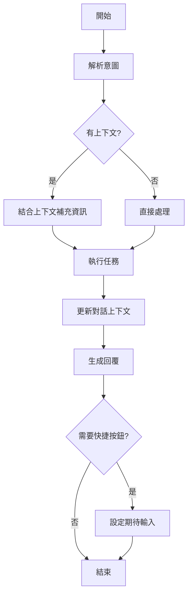

# 多輪對話功能規劃文檔

## 1. 問題分析（第一性原則）

### 1.1 問題本質
LINE Bot 的每個 webhook 請求都是無狀態的，但人類對話本質上是有狀態和上下文的。當前系統將每個用戶輸入當作獨立請求處理，導致無法理解依賴上下文的簡短回應。

### 1.1.1 無狀態環境的挑戰
**關鍵問題**：Vercel/Render 等無狀態環境會隨時重啟、釋放記憶體
- ❌ **Map() 不可行**：存在記憶體中的資料會隨著服務重啟而消失
- ❌ **全域變數不可行**：每個請求可能由不同的實例處理
- ✅ **必須使用外部儲存**：Redis 提供獨立於應用實例的持久化儲存

**為什麼選擇 Redis？**
1. **高效能**：記憶體資料庫，讀寫速度快（毫秒級）
2. **TTL 支援**：原生支援資料過期，自動清理
3. **Serverless 友好**：Upstash 等服務專為無狀態環境設計
4. **簡單可靠**：成熟的解決方案，易於整合

### 1.2 Quick Reply 功能失效原因
```
用戶：小明今天下午3點數學課
Bot：✅ 已為您安排...
     [確認] [修改] [取消操作]  <-- Quick Reply 按鈕

用戶點擊 [確認]
Bot：❓ 抱歉，我不太理解您的意思... <-- 無法識別「確認」的意圖
```

**根本原因**：
1. 意圖規則中沒有定義「確認」、「修改」等操作性關鍵詞
2. 即使定義了，也無法知道要「確認什麼」或「修改什麼」
3. 缺乏對話上下文管理機制

### 1.3 核心需求
1. **記憶能力**：記住最近的對話內容和操作上下文
2. **理解能力**：基於上下文理解簡短回應的真實意圖
3. **狀態追蹤**：追蹤對話流程的當前狀態（如等待確認、等待補充資訊等）

## 2. 設計方案

### 2.1 對話狀態結構
```javascript
{
  userId: "U12345...",
  lastActivity: 1735123456789, // 時間戳，用於超時清理
  state: {
    // 當前對話狀態
    currentFlow: "course_creation", // 當前流程：null | course_creation | course_modification | content_recording
    expectingInput: ["confirmation", "course_details"], // 複合期待：可接受多種輸入類型
    
    // 多意圖平行的操作上下文（避免流程互相干擾）
    lastActions: {
      add_course: {
        intent: "add_course",
        slots: {
          studentName: "小明",
          courseName: "數學課",
          courseDate: "2025-08-05",
          scheduleTime: "15:00"
        },
        result: {
          success: true,
          courseId: "abc123",
          message: "已為您安排..."
        },
        timestamp: 1735123456789
      },
      record_content: {
        intent: "record_content",
        slots: {
          studentName: "小明",
          courseName: "英文課",
          content: "今天學習字母A-Z"
        },
        result: {
          success: true,
          recordId: "xyz789",
          message: "已記錄課程內容"
        },
        timestamp: 1735123455789
      }
      // 可同時保存多個意圖的上下文
    },
    
    // 待處理的資料
    pendingData: {
      studentName: "小明",
      courseName: "數學課",
      // ... 其他待確認的資料
    },
    
    // 對話歷史（保留最近5輪）
    history: [
      {
        role: "user",
        message: "小明今天下午3點數學課",
        intent: "add_course",
        timestamp: 1735123450000
      },
      {
        role: "assistant",
        message: "已為您安排...",
        quickReply: [
          {
            label: "確認",
            text: "確認",
            payload: {
              type: "confirm_action",
              relatedIntent: "add_course",
              relatedCourseId: "abc123"
            }
          },
          {
            label: "修改",
            text: "修改",
            payload: {
              type: "modify_action",
              relatedIntent: "add_course",
              relatedCourseId: "abc123"
            }
          },
          {
            label: "取消操作",
            text: "取消操作",
            payload: {
              type: "cancel_action",
              relatedIntent: "add_course",
              relatedCourseId: "abc123"
            }
          }
        ],
        timestamp: 1735123451000
      }
    ],
    
    // 提及的實體快取
    mentionedEntities: {
      students: ["小明"],
      courses: ["數學課", "英文課"],
      dates: ["今天", "2025-08-05"],
      times: ["下午3點", "15:00"]
    }
  }
}
```

### 2.2 對話流程狀態機



### 2.3 Quick Reply 整合方案

#### 2.3.1 操作性意圖定義
新增專門處理操作性回應的意圖：

```yaml
# 確認操作
confirm_action:
  keywords: ['確認', '好', '好的', '是', '是的', '沒錯', '正確', 'ok', 'OK']
  priority: 15  # 最高優先級
  context_required: true  # 標記需要上下文
  payload_fallback: true  # 支援 payload 解析
  examples:
    - "確認"
    - "好的"
    - "沒錯"

# 修改操作  
modify_action:
  keywords: ['修改', '更改', '改', '調整', '編輯']
  priority: 15
  context_required: true
  payload_fallback: true
  examples:
    - "修改"
    - "我要改"

# 取消操作
cancel_action:
  keywords: ['取消', '不要了', '算了', '取消操作']
  priority: 15
  context_required: true
  payload_fallback: true
  examples:
    - "取消操作"
    - "不要了"
```

#### 2.3.2 Quick Reply Payload 處理
```javascript
// LINE 的 Quick Reply 可以附帶 postback data
function createQuickReplyWithPayload(label, text, payload) {
  return {
    type: 'action',
    action: {
      type: 'message',
      label: label,
      text: text,
      // LINE 不支援 message action 帶 data，需要編碼在文字中
      // 或使用 postback action 替代
    }
  };
}

// 使用 postback action 攜帶 payload
function createPostbackQuickReply(label, displayText, data) {
  return {
    type: 'action',
    action: {
      type: 'postback',
      label: label,
      displayText: displayText,
      data: JSON.stringify(data)
    }
  };
}
```

#### 2.3.3 上下文感知的意圖處理
```javascript
async function parseIntentWithContext(message, userId, event) {
  const context = await conversationManager.getContext(userId);
  
  // 0. 檢查是否為 postback 事件（Quick Reply with payload）
  if (event.type === 'postback' && event.postback?.data) {
    try {
      const payload = JSON.parse(event.postback.data);
      if (payload.type) {
        // 直接從 payload 解析意圖
        return {
          intent: payload.type,
          metadata: payload
        };
      }
    } catch (e) {
      console.warn('Failed to parse postback data:', e);
    }
  }
  
  // 1. 先嘗試規則匹配
  let intent = parseIntentByRules(message);
  
  // 2. 如果是需要上下文的意圖，檢查是否有有效上下文
  if (intent && intentRules[intent]?.context_required) {
    if (!context?.state?.expectingInput?.length) {
      // 沒有期待的輸入，這個操作性回應可能是誤判
      intent = 'unknown';
    }
  }
  
  // 3. 如果沒有匹配到意圖，但有期待的輸入，嘗試理解
  if (intent === 'unknown' && context?.state?.expectingInput?.length > 0) {
    intent = inferIntentFromContext(message, context);
  }
  
  return intent;
}

// 根據上下文推斷意圖
function inferIntentFromContext(message, context) {
  const { expectingInput, currentFlow } = context.state;
  
  // 根據期待的輸入類型推斷
  if (expectingInput.includes('confirmation')) {
    // 檢查是否為肯定性回應
    const positiveKeywords = ['好', '是', '對', '沒錯', 'ok', 'yes'];
    if (positiveKeywords.some(kw => message.toLowerCase().includes(kw))) {
      return 'confirm_action';
    }
  }
  
  if (expectingInput.includes('course_content_text')) {
    // 如果在等待課程內容，任何文字都視為內容輸入
    return 'provide_content';
  }
  
  return 'unknown';
}
```

### 2.4 對話管理器（ConversationManager）- Redis 版本

```javascript
const Redis = require('ioredis');

class ConversationManager {
  constructor(redisConfig = {}) {
    // 使用 Redis 儲存對話狀態（適用於無狀態環境）
    this.redis = new Redis({
      host: process.env.REDIS_HOST || redisConfig.host,
      port: process.env.REDIS_PORT || redisConfig.port || 6379,
      password: process.env.REDIS_PASSWORD || redisConfig.password,
      tls: process.env.REDIS_TLS === 'true' ? {} : undefined,
      // Upstash Redis 相容設定
      family: 4,
      db: 0,
      // 連接重試策略
      retryStrategy: (times) => {
        const delay = Math.min(times * 50, 2000);
        return delay;
      },
      // 錯誤處理
      enableOfflineQueue: false
    });
    
    // Redis 連接事件處理
    this.redis.on('error', (err) => {
      console.error('Redis 連接錯誤:', err);
    });
    
    this.redis.on('connect', () => {
      console.log('✅ Redis 連接成功');
    });
    
    // 對話過期時間（30分鐘）
    this.TTL_SECONDS = 30 * 60;
  }
  
  // 生成 Redis key
  _getKey(userId) {
    return `conversation:${userId}`;
  }
  
  // 獲取對話上下文
  async getContext(userId) {
    try {
      const key = this._getKey(userId);
      const data = await this.redis.get(key);
      
      if (!data) return null;
      
      const context = JSON.parse(data);
      
      // 重新設定過期時間（滑動視窗）
      await this.redis.expire(key, this.TTL_SECONDS);
      
      return context;
    } catch (error) {
      console.error('獲取對話上下文失敗:', error);
      // 降級處理：Redis 失敗時返回 null
      return null;
    }
  }
  
  // 更新對話上下文
  async updateContext(userId, updates) {
    try {
      const key = this._getKey(userId);
      const existing = await this.getContext(userId) || { userId, state: {} };
      
      const updated = {
        ...existing,
        ...updates,
        lastActivity: Date.now()
      };
      
      // 維護歷史記錄（最多5輪）
      if (updated.state?.history?.length > 10) {
        updated.state.history = updated.state.history.slice(-10);
      }
      
      // 序列化並儲存到 Redis，同時設定過期時間
      await this.redis.setex(
        key, 
        this.TTL_SECONDS, 
        JSON.stringify(updated)
      );
      
      return updated;
    } catch (error) {
      console.error('更新對話上下文失敗:', error);
      // 降級處理：記錄錯誤但不中斷流程
      return null;
    }
  }
  
  // 刪除對話上下文
  async deleteContext(userId) {
    try {
      const key = this._getKey(userId);
      await this.redis.del(key);
    } catch (error) {
      console.error('刪除對話上下文失敗:', error);
    }
  }
  
  // 設定期待的輸入（支援複合期待）
  async setExpectation(userId, flowType, inputTypes, pendingData = {}) {
    const context = await this.getContext(userId) || { userId, state: {} };
    
    if (!context.state) context.state = {};
    
    context.state.currentFlow = flowType;
    // 確保 inputTypes 是陣列格式
    context.state.expectingInput = Array.isArray(inputTypes) ? inputTypes : [inputTypes];
    context.state.pendingData = pendingData;
    
    await this.updateContext(userId, context);
  }
  
  // 清除期待狀態
  async clearExpectation(userId) {
    const context = await this.getContext(userId);
    if (context?.state) {
      context.state.currentFlow = null;
      context.state.expectingInput = [];
      context.state.pendingData = {};
      await this.updateContext(userId, context);
    }
  }
  
  // 更新特定意圖的 lastAction
  async updateLastAction(userId, intent, actionData) {
    const context = await this.getContext(userId) || { userId, state: {} };
    
    if (!context.state) context.state = {};
    if (!context.state.lastActions) context.state.lastActions = {};
    
    context.state.lastActions[intent] = {
      ...actionData,
      timestamp: Date.now()
    };
    
    await this.updateContext(userId, context);
  }
  
  // 獲取特定意圖的 lastAction
  async getLastAction(userId, intent) {
    const context = await this.getContext(userId);
    return context?.state?.lastActions?.[intent] || null;
  }
  
  // 健康檢查
  async healthCheck() {
    try {
      await this.redis.ping();
      return { status: 'healthy', storage: 'redis' };
    } catch (error) {
      return { status: 'unhealthy', storage: 'redis', error: error.message };
    }
  }
  
  // 關閉連接（優雅關機）
  async close() {
    await this.redis.quit();
  }
}
```

### 2.5 ConversationManager 初始化與使用

```javascript
// src/services/conversationManager.js
const ConversationManager = require('./ConversationManager');

// 單例模式，確保全域只有一個實例
let instance = null;

function getConversationManager() {
  if (!instance) {
    instance = new ConversationManager({
      // 可選：如果環境變數未設定，使用預設值
      host: process.env.REDIS_HOST,
      port: process.env.REDIS_PORT,
      password: process.env.REDIS_PASSWORD
    });
  }
  return instance;
}

// 優雅關機處理
process.on('SIGTERM', async () => {
  if (instance) {
    await instance.close();
  }
});

module.exports = { getConversationManager };
```

### 2.6 整合修改方案

#### 2.5.1 webhook.js 修改
```javascript
async function handleTextMessage(event) {
  const userMessage = event.message.text;
  const userId = event.source.userId;
  
  // 1. 獲取對話上下文
  const context = await conversationManager.getContext(userId);
  
  // 2. 解析意圖（考慮上下文）
  const intent = await parseIntentWithContext(userMessage, userId);
  
  // 3. 處理操作性意圖
  if (isActionIntent(intent)) {
    // 從意圖元資料或上下文確定相關的意圖
    const relatedIntent = intent.metadata?.relatedIntent || 
                         guessRelatedIntent(context?.state?.currentFlow);
    const lastAction = await conversationManager.getLastAction(userId, relatedIntent);
    
    if (lastAction) {
      return handleActionIntent(intent, lastAction, context, event);
    }
  }
  
  // 4. 提取 slots（使用上下文補充）
  const slots = await extractSlotsWithContext(userMessage, intent, userId, context);
  
  // 5. 執行任務
  const result = await executeTask(intent, slots, userId, event);
  
  // 6. 更新對話上下文
  await updateConversationContext(userId, intent, slots, result);
  
  // 7. 生成回覆（包含 Quick Reply）
  await sendReplyWithContext(event, result, intent, userId);
}

// 處理操作性意圖
async function handleActionIntent(intent, lastAction, context, event) {
  const { type } = intent;
  const { replyToken } = event;
  
  switch (type) {
    case 'confirm_action':
      // 執行確認邏輯
      await lineService.replyMessage(replyToken, 
        `✅ 已確認${lastAction.slots.courseName || '課程'}安排`);
      await conversationManager.clearExpectation(event.source.userId);
      break;
      
    case 'modify_action':
      // 進入修改流程
      await conversationManager.setExpectation(
        event.source.userId, 
        'course_modification',
        ['course_details', 'time_selection'],
        lastAction.slots
      );
      await lineService.replyMessage(replyToken, 
        '請告訴我您要修改什麼？（例如：改成下午4點）');
      break;
      
    case 'cancel_action':
      // 取消操作
      await lineService.replyMessage(replyToken, '❌ 已取消操作');
      await conversationManager.clearExpectation(event.source.userId);
      break;
  }
}
```

#### 2.5.2 extractSlots.js 修改
```javascript
async function extractSlotsWithContext(message, intent, userId, context) {
  // 1. 先執行原有的提取邏輯
  const slots = await extractSlots(message, intent, userId);
  
  // 2. 從上下文補充缺失的資訊
  if (context?.state?.mentionedEntities) {
    // 如果缺少學生名稱，從最近提到的學生中選擇
    if (!slots.studentName && context.state.mentionedEntities.students?.length > 0) {
      slots.studentName = context.state.mentionedEntities.students[0];
      slots._fromContext = { studentName: true }; // 標記來源
    }
    
    // 如果缺少課程名稱，嘗試匹配
    if (!slots.courseName && context.state.mentionedEntities.courses?.length > 0) {
      const matchedCourse = findMatchingCourse(message, context.state.mentionedEntities.courses);
      if (matchedCourse) {
        slots.courseName = matchedCourse;
        slots._fromContext = { ...slots._fromContext, courseName: true };
      }
    }
  }
  
  return slots;
}
```

## 3. 實作步驟

### Phase 0：Redis 環境設定（0.5天）
1. 選擇並註冊 Redis 服務（建議 Upstash 或 Redis Labs）
2. 取得連接資訊並設定環境變數
3. 安裝 ioredis 套件：`npm install ioredis`
4. 測試 Redis 連接

#### 環境變數配置
```bash
# .env
REDIS_HOST=your-redis-host.upstash.io
REDIS_PORT=6379
REDIS_PASSWORD=your-redis-password
REDIS_TLS=true  # Upstash 需要 TLS
```

### Phase 1：基礎架構（2天）
1. 實作 Redis 版 ConversationManager 類
2. 新增操作性意圖到 intent-rules.yaml
3. 修改 parseIntent.js 支援上下文感知
4. 加入對話狀態的記錄和更新邏輯

### Phase 2：Quick Reply 整合（1天）
1. 實作操作性意圖的處理函式
2. 修改 webhook.js 整合對話管理器
3. 確保 Quick Reply 按鈕與期待輸入的對應
4. 測試各種 Quick Reply 場景

### Phase 3：上下文補充（2天）
1. 修改 extractSlots.js 支援上下文補充
2. 實作智慧的實體匹配邏輯
3. 處理多個候選實體的歧義消除
4. 測試上下文傳遞的準確性

### Phase 4：優化與邊界處理（1天）
1. 處理超時和異常情況
2. 優化記憶體使用
3. 加入必要的日誌和監控
4. 完整的整合測試

## 4. 測試場景

### 4.1 基本 Quick Reply 測試
```
用戶：小明今天下午3點數學課
Bot：已安排... [確認][修改][取消]
用戶：確認
Bot：✅ 課程已確認儲存
```

### 4.2 修改流程測試
```
用戶：小明今天下午3點數學課
Bot：已安排... [確認][修改][取消]
用戶：修改
Bot：請問您要修改什麼？
用戶：改成4點
Bot：已更新為4點 [確認][取消]
```

### 4.3 上下文補充測試
```
用戶：小明今天有什麼課？
Bot：小明今天有數學課(15:00)和英文課(17:00)
用戶：記錄數學課的內容
Bot：請輸入數學課的學習內容 [理解到是要記錄數學課]
```

### 4.4 圖片上傳與上下文
```
用戶：記錄小明今天數學課的內容
Bot：請輸入內容或上傳照片
用戶：[上傳圖片]
Bot：已記錄照片到小明今天的數學課 [自動關聯]
```

### 4.5 平行意圖處理
```
用戶：小明今天下午3點數學課
Bot：已安排... [確認][修改][取消]
用戶：記錄昨天英文課很棒
Bot：已記錄英文課內容
用戶：確認
Bot：✅ 已確認數學課安排 [正確識別是要確認數學課，而非英文課]
```

## 5. 技術考量

### 5.1 記憶體管理
- 每個對話狀態約 2-5KB
- 1000 個活躍用戶約需 5MB 記憶體
- 定期清理超過 30 分鐘的對話

### 5.2 持久化方案
- ~~Phase 1：記憶體 Map（不適用於無狀態環境）~~
- **Phase 1：Redis（必須立即採用）** ← 當前選擇
- Phase 2：Firebase（統一儲存，未來考慮）

#### Redis 服務選擇建議
| 服務商 | 優點 | 缺點 | 建議場景 |
|--------|------|------|----------|
| **Upstash** | • Serverless 友好<br>• 按請求計費<br>• 全球邊緣部署 | • 每日免費額度有限 | Vercel 部署首選 |
| **Redis Labs** | • 30MB 免費額度<br>• 穩定可靠 | • 需要持續連接 | Render 部署適用 |
| **Railway Redis** | • 易於整合<br>• $5/月起 | • 需付費 | 生產環境 |

### 5.3 錯誤處理
- 上下文遺失：降級為無上下文處理
- 歧義處理：詢問用戶確認
- 超時處理：自動清理並提示重新開始

### 5.4 重要澄清：Session vs Long-term Memory
本設計為 **Session-based Memory（會話記憶）**：
- ✅ 只記住「當下對話流程」的狀態
- ✅ 不保存歷史課程資料（由 Firebase 管理）
- ✅ 不保存任務的完整生命週期
- ✅ 30 分鐘後自動清理，避免記憶體累積

**與長期記憶的區別**：
| 特性 | Session Memory（本設計） | Long-term Memory |
|------|------------------------|------------------|
| 儲存內容 | 對話狀態、待確認資料 | 用戶偏好、歷史記錄 |
| 生命週期 | 30分鐘 | 永久或長期 |
| 儲存位置 | 記憶體 | 資料庫 |
| 用途 | 支援多輪對話 | 個人化服務 |

## 6. 成功指標

1. **Quick Reply 可用率**：> 95% 的按鈕點擊能正確處理
2. **上下文理解準確率**：> 90% 的簡短回應能正確理解
3. **用戶滿意度**：減少「聽不懂」的回應 50% 以上
4. **對話效率**：平均完成任務的對話輪數減少 30%

## 7. 風險與緩解

| 風險 | 影響 | 緩解措施 |
|------|------|----------|
| Redis 連接失敗 | 對話功能降級 | 優雅降級，基本功能仍可運作 |
| Redis 延遲 | 回應變慢 | 設定合理超時，使用就近區域的 Redis |
| 成本超支 | 預算問題 | 監控使用量，設定告警閾值 |
| 資料外洩 | 隱私風險 | 不儲存敏感資料，使用 TLS 加密 |
| 上下文誤用 | 錯誤操作 | 操作前確認、提供撤銷功能 |
| 歧義問題 | 用戶困惑 | 明確詢問、提供選項 |

### 7.1 Redis 特定風險處理

**連接失敗處理策略**：
```javascript
// 在 webhook 中的降級處理
const conversationManager = getConversationManager();
const context = await conversationManager.getContext(userId);

if (!context) {
  const healthStatus = await conversationManager.healthCheck();
  if (healthStatus.status === 'unhealthy') {
    // Redis 故障，降級為無狀態處理
    console.warn('Redis 不可用，降級處理');
    // 繼續基本功能，但無法處理 Quick Reply
  }
}
```

## 8. 未來擴展

1. **多模態上下文**：圖片、語音訊息的上下文理解
2. **長期記憶**：跨會話的偏好和習慣學習
3. **智慧推薦**：基於歷史對話推薦操作
4. **對話流程模板**：預定義的多輪對話腳本