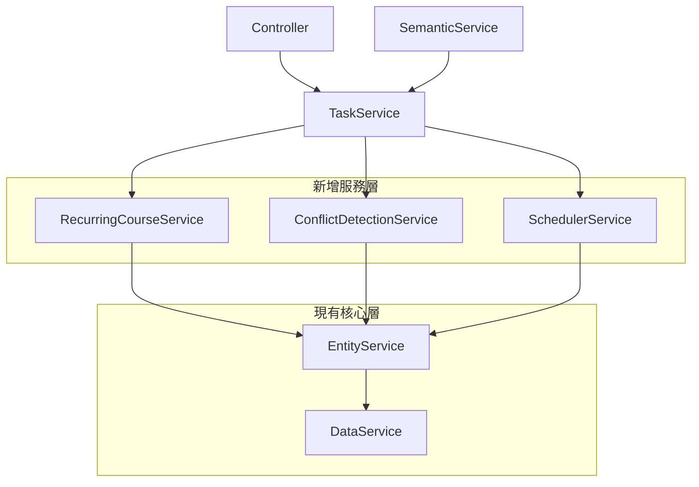
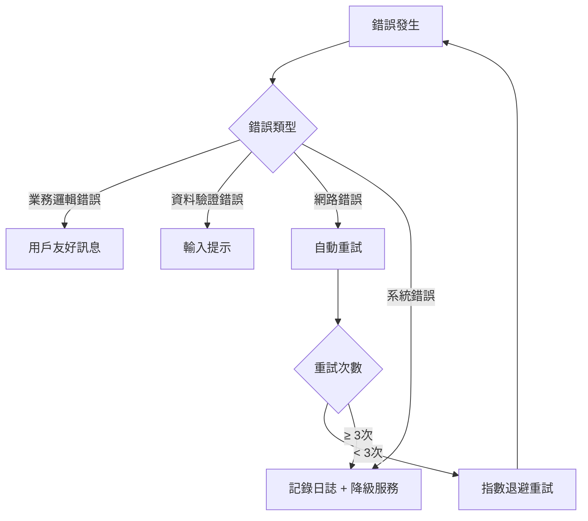
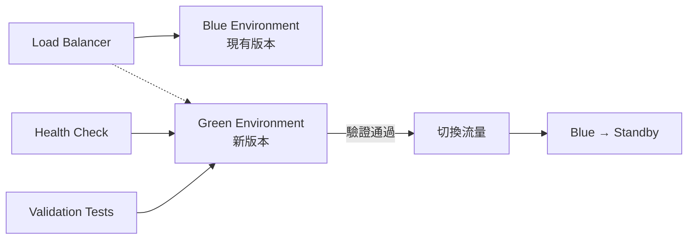

# 高效重複課程系統重構技術設計

## 架構概覽

### 現狀分析
目前的重複課程功能採用「快車道」模式實作，主要邏輯集中在 TaskService 中，雖然實現了功能需求，但存在以下問題：

1. **程式碼集中化過度**: TaskService 承擔過多責任
2. **錯誤處理分散**: lint 錯誤和格式問題
3. **效能瓶頸**: 批量操作和衝突檢測效率不佳
4. **測試困難**: 高耦合度導致單元測試複雜

### 目標架構



## 服務層重構設計

### 1. RecurringCourseService
**職責**: 管理重複課程的生命週期和業務邏輯

```javascript
class RecurringCourseService {
    /**
     * 創建重複課程群組
     * @param {Object} courseData - 課程資料
     * @param {Object} recurringPattern - 重複模式
     * @param {Object} endCondition - 結束條件
     * @returns {Promise<Object>} 創建結果
     */
    async createRecurringCourse(courseData, recurringPattern, endCondition)
    
    /**
     * 修改重複課程
     * @param {string} groupId - 群組ID
     * @param {Object} updates - 更新資料
     * @param {string} scope - 修改範圍 (single|future|all)
     * @returns {Promise<Object>} 修改結果
     */
    async modifyRecurringCourse(groupId, updates, scope)
    
    /**
     * 停止重複課程
     * @param {string} groupId - 群組ID
     * @param {Date} stopDate - 停止日期
     * @returns {Promise<Object>} 停止結果
     */
    async stopRecurringCourse(groupId, stopDate)
    
    /**
     * 查詢重複課程
     * @param {Object} filters - 查詢條件
     * @returns {Promise<Array>} 課程列表
     */
    async queryRecurringCourses(filters)
}
```

### 2. ConflictDetectionService
**職責**: 高效的時間衝突檢測和解決方案提供

```javascript
class ConflictDetectionService {
    /**
     * 檢測時間衝突
     * @param {Array} courseInstances - 課程實例
     * @param {Array} existingCourses - 現有課程
     * @returns {Promise<Object>} 衝突分析結果
     */
    async detectConflicts(courseInstances, existingCourses)
    
    /**
     * 建議衝突解決方案
     * @param {Array} conflicts - 衝突列表
     * @returns {Array} 解決方案選項
     */
    generateResolutionOptions(conflicts)
    
    /**
     * 應用衝突解決方案
     * @param {string} groupId - 群組ID
     * @param {Object} resolution - 解決方案
     * @returns {Promise<Object>} 應用結果
     */
    async applyResolution(groupId, resolution)
}
```

### 3. SchedulerService (重構現有 RecurringCourseScheduler)
**職責**: 智能化的自動調度和維護

```javascript
class SchedulerService {
    /**
     * 智能生成課程實例
     * @param {string} groupId - 群組ID
     * @param {Object} options - 生成選項
     * @returns {Promise<Array>} 生成的課程實例
     */
    async generateCourseInstances(groupId, options)
    
    /**
     * 執行定期維護
     * @returns {Promise<Object>} 維護結果
     */
    async performMaintenance()
    
    /**
     * 預測性調度
     * @param {Date} targetDate - 目標日期
     * @returns {Promise<Array>} 調度計劃
     */
    async predictiveScheduling(targetDate)
}
```

## 資料模型優化

### 1. 索引策略優化

```javascript
// firestore.indexes.json 優化
{
  "indexes": [
    {
      "collectionGroup": "courses",
      "fields": [
        {"fieldPath": "recurring_group_id", "order": "ASCENDING"},
        {"fieldPath": "timeInfo.start", "order": "ASCENDING"},
        {"fieldPath": "status", "order": "ASCENDING"}
      ]
    },
    {
      "collectionGroup": "recurring_groups",
      "fields": [
        {"fieldPath": "status", "order": "ASCENDING"},
        {"fieldPath": "pattern.type", "order": "ASCENDING"},
        {"fieldPath": "created_at", "order": "DESCENDING"}
      ]
    }
  ]
}
```

### 2. 查詢效能優化

```javascript
class OptimizedQueries {
    /**
     * 批量衝突檢測查詢
     * 使用時間範圍索引提升效能
     */
    async batchConflictDetection(timeRanges) {
        const promises = timeRanges.map(range => 
            this.dataService.getCoursesInTimeRange(range.start, range.end)
        );
        return Promise.all(promises);
    }
    
    /**
     * 分頁查詢重複課程
     * 使用 cursor-based pagination
     */
    async getPaginatedRecurringCourses(cursor, limit = 20) {
        return this.dataService.queryWithCursor('recurring_groups', {
            orderBy: 'created_at',
            limit,
            startAfter: cursor
        });
    }
}
```

## 錯誤處理架構

### 1. 統一錯誤處理

```javascript
class ErrorHandler {
    /**
     * 業務邏輯錯誤
     */
    static createBusinessError(code, message, details = {}) {
        return new BusinessError(code, message, details);
    }
    
    /**
     * 系統錯誤
     */
    static createSystemError(originalError, context = {}) {
        return new SystemError(originalError, context);
    }
    
    /**
     * 可恢復錯誤處理
     */
    static async handleRecoverableError(error, retryFn, maxRetries = 3) {
        for (let i = 0; i < maxRetries; i++) {
            try {
                return await retryFn();
            } catch (retryError) {
                if (i === maxRetries - 1) throw retryError;
                await this.exponentialBackoff(i);
            }
        }
    }
}
```

### 2. 錯誤分類和處理策略



## 效能最佳化策略

### 1. 批量操作優化

```javascript
class BatchProcessor {
    constructor(batchSize = 50) {
        this.batchSize = batchSize;
    }
    
    /**
     * 批量創建課程實例
     * 控制批次大小避免 Firestore 限制
     */
    async batchCreateInstances(instances) {
        const batches = this.chunkArray(instances, this.batchSize);
        const results = [];
        
        for (const batch of batches) {
            const batchResult = await this.dataService.batchWrite(batch);
            results.push(...batchResult);
            
            // 避免過度負載
            if (batches.length > 1) {
                await this.delay(100);
            }
        }
        
        return results;
    }
}
```

### 2. 快取策略

```javascript
class CacheManager {
    constructor() {
        this.cache = new Map();
        this.ttl = 5 * 60 * 1000; // 5 分鐘
    }
    
    /**
     * 快取重複課程群組資訊
     */
    async getCachedRecurringGroup(groupId) {
        const cacheKey = `recurring_group_${groupId}`;
        
        if (this.cache.has(cacheKey)) {
            const { data, timestamp } = this.cache.get(cacheKey);
            if (Date.now() - timestamp < this.ttl) {
                return data;
            }
        }
        
        const data = await this.dataService.getRecurringGroup(groupId);
        this.cache.set(cacheKey, { data, timestamp: Date.now() });
        return data;
    }
}
```

## 測試策略

### 1. 測試金字塔

```mermaid
pyramid
    title 測試金字塔
    
    level1: 端到端測試 (10%)
        description: 完整用戶流程測試
    
    level2: 整合測試 (30%)
        description: 服務間互動測試
    
    level3: 單元測試 (60%)
        description: 個別函數邏輯測試
```

### 2. 測試架構

```javascript
// 測試工具類
class TestUtils {
    /**
     * 創建測試用重複課程群組
     */
    static createTestRecurringGroup(overrides = {}) {
        return {
            id: 'test-group-' + Date.now(),
            courseName: '測試課程',
            teacher: '測試老師',
            location: '測試地點',
            pattern: { type: 'weekly', days: [1, 3] },
            ...overrides
        };
    }
    
    /**
     * 模擬時間衝突場景
     */
    static createConflictScenario(baseTime) {
        return [
            { start: baseTime, end: new Date(baseTime.getTime() + 60*60*1000) },
            { start: new Date(baseTime.getTime() + 30*60*1000), 
              end: new Date(baseTime.getTime() + 90*60*1000) }
        ];
    }
}
```

## 部署和遷移策略

### 1. 藍綠部署



### 2. 資料遷移計劃

```javascript
class MigrationPlan {
    /**
     * 階段 1: 新服務部署 (不影響現有功能)
     */
    async phase1DeployNewServices() {
        // 部署新的服務層但不啟用
        // 確保向後相容性
    }
    
    /**
     * 階段 2: 功能開關切換
     */
    async phase2EnableNewServices() {
        // 透過功能開關逐步啟用新服務
        // 監控效能和錯誤率
    }
    
    /**
     * 階段 3: 舊代碼清理
     */
    async phase3CleanupOldCode() {
        // 移除舊的實作
        // 確保測試覆蓋率
    }
}
```

## 監控和可觀測性

### 1. 關鍵指標監控

```javascript
class MetricsCollector {
    /**
     * 效能指標
     */
    trackPerformanceMetrics() {
        return {
            courseCreationTime: this.timer('course_creation'),
            conflictDetectionTime: this.timer('conflict_detection'),
            batchOperationTime: this.timer('batch_operation'),
            memoryUsage: process.memoryUsage(),
            activeConnections: this.getActiveConnections()
        };
    }
    
    /**
     * 業務指標
     */
    trackBusinessMetrics() {
        return {
            dailyCoursesCreated: this.counter('courses_created'),
            conflictsDetected: this.counter('conflicts_detected'),
            errorRate: this.gauge('error_rate'),
            userSatisfaction: this.gauge('user_satisfaction')
        };
    }
}
```

### 2. 告警設定

```yaml
alerts:
  - name: HighResponseTime
    condition: avg(response_time) > 2000ms
    action: notify_team
    
  - name: HighErrorRate
    condition: error_rate > 5%
    action: escalate
    
  - name: MemoryLeak
    condition: memory_usage > 200MB
    action: restart_service
```

## 安全性考量

### 1. 資料存取控制

```javascript
class SecurityManager {
    /**
     * 驗證用戶權限
     */
    async validateUserPermission(userId, operation, resource) {
        const permissions = await this.getUserPermissions(userId);
        return permissions.includes(`${operation}:${resource}`);
    }
    
    /**
     * 敏感資料遮罩
     */
    maskSensitiveData(data) {
        const masked = { ...data };
        if (masked.teacher) {
            masked.teacher = this.maskName(masked.teacher);
        }
        return masked;
    }
}
```

### 2. 輸入驗證

```javascript
class InputValidator {
    /**
     * 驗證重複模式
     */
    validateRecurringPattern(pattern) {
        const allowedTypes = ['daily', 'weekly', 'monthly'];
        if (!allowedTypes.includes(pattern.type)) {
            throw new ValidationError('Invalid pattern type');
        }
        
        // 詳細驗證邏輯...
    }
}
```

## 向後相容性保證

### 1. API 版本管理

```javascript
class APIVersionManager {
    /**
     * 支援多版本 API
     */
    async handleRequest(version, endpoint, data) {
        switch(version) {
            case 'v1':
                return this.handleV1Request(endpoint, data);
            case 'v2':
                return this.handleV2Request(endpoint, data);
            default:
                return this.handleLatestRequest(endpoint, data);
        }
    }
}
```

### 2. 資料格式轉換

```javascript
class DataFormatConverter {
    /**
     * 舊格式轉新格式
     */
    convertLegacyFormat(legacyData) {
        return {
            ...legacyData,
            recurring_group_id: legacyData.groupId || null,
            is_recurring: Boolean(legacyData.groupId),
            // 其他轉換邏輯...
        };
    }
}
```