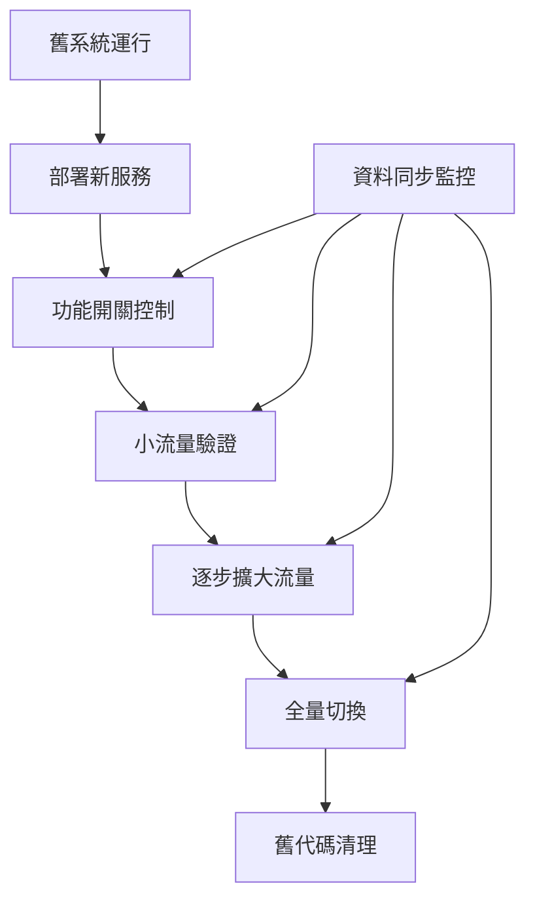

# 資料遷移計劃 - 高效重複課程系統重構

## 🎯 遷移目標

本遷移計劃確保在重構過程中：
1. **零停機時間**: 用戶無感知的平滑遷移
2. **資料完整性**: 100% 資料保全，無遺失風險
3. **可回滾性**: 每個步驟都可以安全回滾
4. **效能監控**: 全程監控系統效能指標

## 📋 現狀評估

### 當前資料結構
```javascript
// 重複課程群組 (recurring_groups 集合)
{
  id: "group_123",
  courseName: "數學課",
  teacher: "王老師", 
  location: "A101教室",
  pattern: {
    type: "weekly",
    days: [1, 3],        // 週一、週三
    interval: 1
  },
  endCondition: {
    type: "count",
    value: 20
  },
  status: "active",
  created_at: "2025-07-28T10:00:00Z",
  // ... 其他欄位
}

// 課程實例 (courses 集合)
{
  id: "course_456",
  courseName: "數學課",
  teacher: "王老師",
  location: "A101教室", 
  date: "2025-07-30",
  timeInfo: {
    start: "2025-07-30T14:00:00Z",
    end: "2025-07-30T15:00:00Z"
  },
  is_recurring: true,
  recurring_group_id: "group_123",
  status: "scheduled",
  // ... 其他欄位
}
```

### 資料量估計
- 重複課程群組: ~100 個
- 相關課程實例: ~2000 個  
- 預估總資料大小: ~5MB
- 日均新增: 10-20 個課程實例

## 🗺️ 遷移策略總覽

### 遷移方法: 雙軌運行 + 漸進切換



## 📅 詳細遷移時程表

### 第一階段: 準備期 (第1-2天)

#### Day 1: 環境準備
- [ ] **08:00-10:00** 部署新服務層 (停用狀態)
  - RecurringCourseService
  - ConflictDetectionService  
  - SchedulerService (重構版)
- [ ] **10:00-12:00** 配置功能開關
  ```javascript
  const FEATURE_FLAGS = {
    NEW_RECURRING_COURSE_SERVICE: false,
    NEW_CONFLICT_DETECTION: false, 
    NEW_SCHEDULER_SERVICE: false
  };
  ```
- [ ] **14:00-16:00** 建立監控儀表板
  - 效能指標監控
  - 錯誤率監控
  - 資料一致性檢查
- [ ] **16:00-18:00** 執行冒煙測試
  - 新服務基礎功能測試
  - 與現有系統相容性測試

#### Day 2: 資料基準建立
- [ ] **08:00-10:00** 建立資料快照
  ```bash
  # 建立完整資料備份
  gcloud firestore export gs://backup-bucket/pre-migration-$(date +%Y%m%d)
  ```
- [ ] **10:00-12:00** 建立資料驗證工具
  ```javascript
  class DataValidator {
    async validateRecurringGroups() {
      // 驗證重複課程群組完整性
    }
    
    async validateCourseInstances() {
      // 驗證課程實例關聯正確性
    }
  }
  ```
- [ ] **14:00-16:00** 執行基準效能測試
  - 記錄現有系統效能指標
  - 建立效能比較基準
- [ ] **16:00-18:00** 準備回滾腳本
  ```javascript
  class RollbackManager {
    async rollbackToSnapshot(snapshotId) {
      // 回滾到指定快照
    }
  }
  ```

### 第二階段: 漸進遷移期 (第3-8天)

#### Day 3-4: 查詢功能遷移
- [ ] **Day 3 08:00** 啟用新的查詢服務 (1% 流量)
  ```javascript
  if (Math.random() < 0.01 && FEATURE_FLAGS.NEW_RECURRING_COURSE_SERVICE) {
    return await newRecurringCourseService.queryRecurringCourses(filters);
  }
  return await legacyQueryMethod(filters);
  ```
- [ ] **Day 3 12:00** 監控效能和正確性
  - 比較新舊查詢結果一致性
  - 監控響應時間差異
- [ ] **Day 3 16:00** 流量提升到 10%
- [ ] **Day 4 08:00** 流量提升到 30%
- [ ] **Day 4 16:00** 流量提升到 70%
- [ ] **Day 4 晚上** 全量切換查詢功能

#### Day 5-6: 衝突檢測遷移
- [ ] **Day 5 08:00** 啟用新的衝突檢測 (5% 流量)
  ```javascript
  const useNewConflictDetection = Math.random() < 0.05 && 
    FEATURE_FLAGS.NEW_CONFLICT_DETECTION;
  
  if (useNewConflictDetection) {
    return await conflictDetectionService.detectConflicts(instances);
  }
  return await legacyConflictDetection(instances);
  ```
- [ ] **Day 5 12:00** 驗證衝突檢測準確性
  - 對比新舊演算法結果
  - 確認沒有漏檢或誤檢
- [ ] **Day 5 16:00** 流量提升到 20%
- [ ] **Day 6 08:00** 流量提升到 50%
- [ ] **Day 6 16:00** 全量切換衝突檢測

#### Day 7-8: 創建和修改功能遷移
- [ ] **Day 7 08:00** 啟用新的創建流程 (2% 流量)
- [ ] **Day 7 12:00** 驗證資料完整性
  - 確認新創建的課程資料正確
  - 驗證關聯關係建立正確
- [ ] **Day 7 16:00** 流量提升到 15%
- [ ] **Day 8 08:00** 流量提升到 40%
- [ ] **Day 8 16:00** 全量切換創建功能

### 第三階段: 調度器遷移 (第9-10天)

#### Day 9: 新調度器部署
- [ ] **08:00-10:00** 部署新 SchedulerService
  - 保持舊調度器繼續運行
  - 新調度器僅監控模式
- [ ] **10:00-12:00** 驗證調度邏輯一致性
  ```javascript
  // 同時運行新舊調度器，比較結果
  const oldResults = await oldScheduler.generateInstances();
  const newResults = await newScheduler.generateInstances();
  validateSchedulingConsistency(oldResults, newResults);
  ```
- [ ] **14:00-16:00** 測試調度效能
  - 比較記憶體使用
  - 比較執行時間
- [ ] **16:00-18:00** 準備切換腳本

#### Day 10: 調度器切換
- [ ] **08:00** 停止舊調度器
- [ ] **08:05** 啟動新調度器
- [ ] **08:10** 驗證調度正常運行
- [ ] **全天** 密切監控調度器運行狀態

### 第四階段: 清理期 (第11-14天)

#### Day 11-12: 舊代碼清理準備
- [ ] **Day 11** 確認所有新功能穩定運行
  - 連續 24 小時無重大錯誤
  - 效能指標符合預期
- [ ] **Day 12** 建立清理前最後備份
  ```bash
  gcloud firestore export gs://backup-bucket/pre-cleanup-$(date +%Y%m%d)
  ```

#### Day 13-14: 舊代碼移除
- [ ] **Day 13** 移除功能開關
  ```javascript
  // 移除所有 FEATURE_FLAGS 判斷邏輯
  // 直接使用新服務
  ```
- [ ] **Day 13** 移除舊業務邏輯
  - 從 TaskService 移除重複課程處理邏輯
  - 移除舊的 RecurringCourseScheduler
- [ ] **Day 14** 程式碼清理和文檔更新
  - ESLint 檢查和修復
  - 更新 API 文檔
  - 更新架構圖

## 🛡️ 風險管控措施

### 風險識別與緩解

#### 高風險: 資料遺失
**緩解措施:**
- 每階段前建立完整備份
- 實作雙寫機制確保資料同步
- 建立資料驗證工具持續檢查

#### 中風險: 效能下降
**緩解措施:**
- 建立效能基準線
- 小流量驗證效能表現
- 準備緊急回滾機制

#### 中風險: 服務中斷
**緩解措施:**
- 採用藍綠部署避免服務中斷
- 建立健康檢查機制
- 準備熱修復機制

### 監控告警設置

```javascript
const MIGRATION_ALERTS = {
  dataLoss: {
    condition: 'data_consistency_check_failed',
    action: 'immediate_rollback',
    severity: 'critical'
  },
  performanceDegradation: {
    condition: 'response_time > baseline * 1.5',
    action: 'reduce_traffic_percentage',
    severity: 'high'
  },
  errorRateIncrease: {
    condition: 'error_rate > 5%',
    action: 'pause_migration',
    severity: 'high'
  }
};
```

## 🔄 回滾計劃

### 快速回滾 (< 5 分鐘)
```javascript
class EmergencyRollback {
  async quickRollback() {
    // 1. 立即停用功能開關
    await this.disableAllFeatureFlags();
    
    // 2. 切換到舊服務
    await this.switchToLegacyServices();
    
    // 3. 通知監控系統
    await this.notifyRollback('emergency');
  }
}
```

### 完整回滾 (< 30 分鐘)
```javascript
class FullRollback {
  async fullRollback(snapshotId) {
    // 1. 停止新服務
    await this.stopNewServices();
    
    // 2. 恢復資料快照
    await this.restoreDataSnapshot(snapshotId);
    
    // 3. 重新部署舊版本
    await this.deployLegacyVersion();
    
    // 4. 驗證系統正常
    await this.validateSystemHealth();
  }
}
```

## 📊 成功指標驗證

### 技術指標
- [ ] **效能提升**: 平均響應時間 < 2 秒 (目標: 從 3.5s 降到 2s)
- [ ] **錯誤率控制**: 錯誤率 < 1% (目標: 降低 80%)
- [ ] **資料一致性**: 100% 資料完整性
- [ ] **系統穩定性**: 可用性 > 99.9%

### 業務指標  
- [ ] **用戶體驗**: 用戶操作成功率 > 99%
- [ ] **功能完整性**: 所有重複課程功能正常
- [ ] **相容性**: 現有 API 100% 向後相容

### 運維指標
- [ ] **部署成功率**: 100% 成功部署
- [ ] **回滾測試**: 所有回滾腳本驗證通過
- [ ] **監控覆蓋**: 100% 關鍵路徑監控

## 📝 遷移檢查清單

### 遷移前檢查
- [ ] 新服務完整部署且測試通過
- [ ] 資料備份建立且驗證可恢復
- [ ] 監控告警系統配置完成
- [ ] 回滾腳本準備且測試通過
- [ ] 團隊成員熟悉應急處理流程

### 遷移中檢查
- [ ] 每個階段效能指標符合預期
- [ ] 資料一致性驗證通過
- [ ] 錯誤率控制在可接受範圍
- [ ] 用戶回饋無重大問題

### 遷移後檢查
- [ ] 所有功能驗證正常
- [ ] 效能指標達到預期目標
- [ ] 監控系統運行正常
- [ ] 文檔更新完成
- [ ] 團隊培訓完成

## 🎯 遷移後維護

### 短期維護 (遷移後 1 週)
- 每日監控關鍵指標
- 及時處理用戶回饋
- 密切關注系統穩定性

### 中期維護 (遷移後 1 個月)
- 每週效能分析報告
- 持續優化瓶頸點
- 建立長期監控基準

### 長期維護 (遷移後 3 個月)
- 每月架構健康度評估
- 規劃下一階段優化
- 總結遷移經驗和教訓