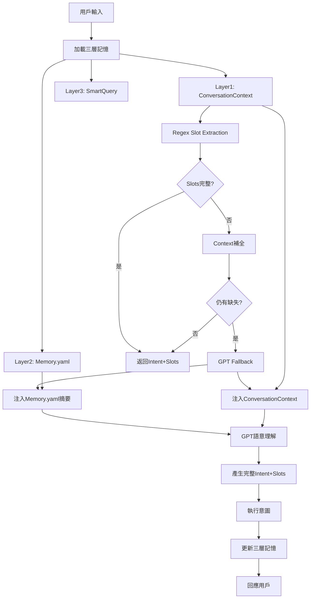

# 🚀 三層語意記憶系統實施計劃 (Long Memory Enhancement Implementation Plan)

---

## 📊 現狀分析 & 第一性原則審視

### 當前系統評估
- **ConversationContext**: 90% ✅ (基礎架構完整)
- **Memory.yaml系統**: 0% ❌ (尚未實現)
- **SmartQueryEngine**: 0% ❌ (尚未實現)
- **Regex→GPT分流機制**: 30% ⚠️ (基礎regex存在，GPT fallback未整合)
- **三層協作機制**: 0% ❌ (各層獨立運作)

### 🔍 根本問題識別 (基於第一性原則)

**問題核心**: 用戶的自然語言表達具有繁複、省略、依賴上下文的特性，需要語意系統能夠：
1. 理解上一段對話、接續下一個計畫
2. 從用戶語句裡補全所有需要的欄位 (slots)

**當前缺失**: 
- 缺乏語意背景記憶 (Memory.yaml)
- 缺乏實時查詢能力 (SmartQueryEngine)
- 缺乏統一的智能分流機制

---

## 🎯 三層語意記憶架構目標

### 📁 核心三層設計

| 層級 | 組件 | 功能定位 | 用途場景 |
|------|------|----------|----------|
| Layer 1 | **ConversationContext** | 短期記憶 | 續說/修改/後悔 |
| Layer 2 | **Memory.yaml** | 語意背景 | 不相連話的語意接續 |
| Layer 3 | **SmartQueryEngine** | 資料實時查詢 | 明確語句進行資料回應 |

### ⚡ 智能分流機制核心流程

```plaintext
User 輸入
   ↓
[1] 加載 ConversationContext & Memory.yaml
   ↓
[2] Regex slot extraction
   → 如果 slot 全部完成 → 返回 intent + slot
   → 如果有欄位缺失 → 使用 context 補全
   → 如果仍不足 → GPT fallback
   ↓
[3] GPT fallback prompt 內含:
     - 使用者語句
     - Memory.yaml (YAML summary)
     - context (lastCourse, lastStudent, etc)
   ↓
[4] GPT 用語意背景充分理解 intent + slot
   ↓
[5] 產生回應
```

---

## 🏗️ 系統架構重構設計

### 新增核心組件架構

```typescript
// 🌐 三層語意記憶系統架構
interface LongMemorySystem {
  // Layer 1: ConversationContext (現有，需增強)
  conversationContext: {
    storage: Map<UserId, ConversationState>
    ttl: 5 * 60 * 1000  // 5分鐘TTL
    updateTriggers: string[]  // 擴展意圖觸發範圍
  }
  
  // Layer 2: Memory.yaml (新增)
  memoryYaml: {
    storage: Map<UserId, UserMemory>  // 用戶隔離
    maxRecords: 20  // 最多20筆記錄
    updateSchedule: '0 4 * * *'  // 每日凌晨4點更新
    contentTypes: ['latest', 'recurring', 'recent']
  }
  
  // Layer 3: SmartQueryEngine (新增)
  smartQueryEngine: {
    realTimeQuery: boolean
    explicitDataResponse: boolean
    firebaseIntegration: boolean
  }
  
  // 🧠 智能分流引擎
  intelligentRouting: {
    regexFirst: RegexSlotExtractor
    gptFallback: OpenAIFallbackEngine
    memoryInjection: MemoryInjectionEngine
  }
}
```

### 數據流程重構



---

## 🔧 分階段實施計劃

### Phase 1: Memory.yaml 系統基礎建設 (2週)

#### 1.1 Memory.yaml 數據結構設計
```typescript
// 📦 Memory.yaml 數據結構
interface UserMemory {
  userId: string
  students: {
    [studentName: string]: {
      courses: CourseRecord[]
      preferences: StudentPreferences
    }
  }
  recentActivities: RecentActivity[]
  recurringPatterns: RecurringPattern[]
  lastUpdated: ISODateTime
}

interface CourseRecord {
  courseName: string
  schedule: {
    date?: string
    time?: string
    recurring?: 'weekly' | 'monthly'
    dayOfWeek?: number
  }
  teacher?: string
  location?: string
  notes?: string
  frequency: number  // 提到次數，用於重要性排序
}
```

#### 1.2 Memory.yaml 管理服務
```javascript
// 🗃️ Memory.yaml 管理服務
class MemoryYamlService {
  constructor() {
    this.cache = new Map();  // 用戶記憶快取
    this.maxRecords = 20;
  }
  
  async getUserMemory(userId) {
    // 快取優先策略
    if (this.cache.has(userId)) {
      return this.cache.get(userId);
    }
    
    const memoryFile = `memory/${userId}.yaml`;
    const memory = await this.loadYamlFile(memoryFile);
    this.cache.set(userId, memory);
    return memory;
  }
  
  async updateUserMemory(userId, newRecord) {
    const memory = await this.getUserMemory(userId);
    
    // 智能更新邏輯
    this.insertOrUpdateRecord(memory, newRecord);
    this.maintainRecordLimit(memory);
    this.updateRecurringPatterns(memory);
    
    // 同步更新快取和檔案
    this.cache.set(userId, memory);
    await this.saveYamlFile(`memory/${userId}.yaml`, memory);
  }
  
  // 🎯 關鍵方法：生成GPT可用的記憶摘要
  generateMemorySummary(userId) {
    const memory = this.cache.get(userId);
    if (!memory) return '';
    
    return this.formatForGPT(memory);
  }
}
```

#### 1.3 實施檢查點
```javascript
// Phase 1 里程碑
const phase1Milestones = {
  week1_day3: "Memory.yaml數據結構確認",
  week1_day7: "基礎CRUD操作完成",
  week2_day3: "快取機制整合",
  week2_day5: "定時更新job建立",
  week2_day7: "Phase 1 完整測試"
};
```

### Phase 2: SmartQueryEngine 建設 (1.5週)

#### 2.1 SmartQueryEngine 核心邏輯
```javascript
// 🔍 SmartQueryEngine 實時查詢引擎
class SmartQueryEngine {
  constructor(dataService) {
    this.dataService = dataService;
  }
  
  async handleExplicitQuery(text, userId) {
    // 檢測明確查詢意圖
    if (this.isExplicitQuery(text)) {
      const queryType = this.detectQueryType(text);
      return await this.executeQuery(queryType, userId);
    }
    return null;
  }
  
  isExplicitQuery(text) {
    const queryPatterns = [
      /查看|查詢|看看|顯示.*課程/,
      /今天|明天|這週.*有什麼課/,
      /.*課程.*時間表/,
      /.*老師.*課程/
    ];
    return queryPatterns.some(pattern => pattern.test(text));
  }
  
  async executeQuery(queryType, userId) {
    switch(queryType) {
      case 'schedule':
        return await this.dataService.getUserSchedule(userId);
      case 'course_list':
        return await this.dataService.getUserCourses(userId);
      case 'teacher_courses':
        return await this.dataService.getCoursesByTeacher(userId);
      default:
        return null;
    }
  }
}
```

#### 2.2 與現有DataService整合
```javascript
// 🔌 DataService 整合增強
class EnhancedDataService extends DataService {
  constructor() {
    super();
    this.smartQueryEngine = new SmartQueryEngine(this);
  }
  
  async processWithSmartQuery(text, userId) {
    // 優先檢查是否為明確查詢
    const queryResult = await this.smartQueryEngine.handleExplicitQuery(text, userId);
    if (queryResult) {
      return {
        type: 'query_response',
        data: queryResult,
        bypassSemanticProcessing: true
      };
    }
    
    // 否則進入正常語意處理流程
    return null;
  }
}
```

### Phase 3: 智能分流機制整合 (2週)

#### 3.1 增強版SemanticService整合三層記憶
```javascript
// 🧠 增強版語意服務：三層記憶整合
class EnhancedSemanticService extends SemanticService {
  constructor() {
    super();
    this.memoryYamlService = new MemoryYamlService();
    this.smartQueryEngine = new SmartQueryEngine();
  }
  
  async analyzeMessage(text, userId, context = null) {
    // 🚀 Step 1: 檢查SmartQuery層
    const smartQueryResult = await this.smartQueryEngine.handleExplicitQuery(text, userId);
    if (smartQueryResult) {
      return this.formatQueryResponse(smartQueryResult);
    }
    
    // 🚀 Step 2: 加載三層記憶
    const conversationContext = context || ConversationContext.getContext(userId);
    const memoryYaml = await this.memoryYamlService.getUserMemory(userId);
    
    // 🚀 Step 3: Regex第一階段slot提取
    const regexResult = await this.regexSlotExtraction(text, conversationContext);
    
    if (regexResult.complete) {
      // Regex足夠，無需GPT
      await this.updateMemoryAfterSuccess(userId, regexResult);
      return regexResult;
    }
    
    // 🚀 Step 4: GPT Fallback with Memory Injection
    const gptResult = await this.gptFallbackWithMemory(
      text, 
      conversationContext, 
      memoryYaml,
      regexResult.partialSlots
    );
    
    // 🚀 Step 5: 更新三層記憶
    await this.updateTripleMemory(userId, gptResult);
    
    return gptResult;
  }
  
  async gptFallbackWithMemory(text, context, memoryYaml, partialSlots) {
    const memorySummary = this.memoryYamlService.generateMemorySummary(memoryYaml);
    
    const prompt = `
System: 你是一位親切的課程助理，請根據使用者語句和下方記憶，推理用戶想做什麼，並填寫完整欄位

使用者語句: "${text}"

記憶 Memory.yaml:
${memorySummary}

ConversationContext:
- lastCourse: ${context?.lastCourse || 'N/A'}
- lastTime: ${context?.lastTime || 'N/A'}  
- lastStudent: ${context?.lastStudent || 'N/A'}

已提取的部分欄位:
${JSON.stringify(partialSlots, null, 2)}

請產生完整的意圖和欄位:
{
  "intent": "create|modify|cancel|query",
  "slots": {
    "student": "學生姓名",
    "courseName": "課程名稱", 
    "date": "YYYY-MM-DD",
    "time": "HH:MM"
  },
  "confidence": 0.0-1.0
}`;

    return await this.callOpenAI(prompt);
  }
  
  async updateTripleMemory(userId, result) {
    // 更新 ConversationContext
    ConversationContext.updateContext(userId, {
      lastAction: result.intent,
      lastCourse: result.slots.courseName,
      lastStudent: result.slots.student,
      lastTime: result.slots.time
    });
    
    // 更新 Memory.yaml
    if (result.intent === 'create' || result.intent === 'modify') {
      await this.memoryYamlService.updateUserMemory(userId, {
        courseName: result.slots.courseName,
        student: result.slots.student,
        schedule: {
          date: result.slots.date,
          time: result.slots.time
        }
      });
    }
  }
}
```

#### 3.2 Regex優先機制增強
```javascript
// ⚡ Regex優先slot提取增強
class EnhancedRegexExtractor {
  async extractWithContext(text, conversationContext) {
    const baseSlots = await this.standardRegexExtraction(text);
    
    // 使用ConversationContext補全缺失slot
    if (!baseSlots.courseName && conversationContext?.lastCourse) {
      baseSlots.courseName = conversationContext.lastCourse;
      baseSlots._sources.courseName = 'conversation_context';
    }
    
    if (!baseSlots.student && conversationContext?.lastStudent) {
      baseSlots.student = conversationContext.lastStudent;
      baseSlots._sources.student = 'conversation_context';
    }
    
    // 判斷是否完整
    const requiredSlots = ['courseName', 'student', 'date', 'time'];
    const complete = requiredSlots.every(slot => baseSlots[slot]);
    
    return {
      slots: baseSlots,
      complete,
      partialSlots: baseSlots
    };
  }
}
```

### Phase 4: ConversationContext 擴展整合 (1週)

#### 4.1 擴展觸發意圖範圍
```javascript
// 📝 擴展ConversationContext觸發範圍
const expandedUpdateIntents = [
  // 現有
  'record_course', 'modify_course', 'cancel_course',
  
  // 新增課程管理
  'create_recurring_course', 'modify_recurring_course', 'stop_recurring_course',
  
  // 新增內容記錄
  'record_lesson_content', 'record_homework', 'upload_class_photo',
  
  // 新增查詢場景
  'query_schedule', 'query_course_content',
  
  // 新增提醒設置
  'set_reminder'
];
```

#### 4.2 ConversationContext數據結構增強
```javascript
// 🔄 ConversationContext增強版數據結構
class EnhancedConversationContext extends ConversationContext {
  constructor() {
    super();
    this.structure = {
      // 基礎欄位（保持向後兼容）
      lastAction: null,
      lastCourse: null,
      lastTimeInfo: null,
      
      // 新增統計型欄位
      recentCourses: [],  // [{name, frequency}]
      recentStudents: [], // [{name, frequency}]
      
      // 新增用戶偏好學習
      userPreferences: {
        defaultStudent: null,
        commonTimeFormat: null,
        frequentCourses: []
      },
      
      // 新增會話級元數據
      sessionMetadata: {
        startTime: null,
        messageCount: 0,
        multiTurnState: null  // 未完成的多輪對話狀態
      }
    };
  }
  
  updateWithLearning(userId, actionData) {
    const context = this.getContext(userId);
    
    // 學習用戶習慣
    this.learnUserPatterns(context, actionData);
    
    // 更新基礎欄位
    context.lastAction = actionData.intent;
    context.lastCourse = actionData.slots?.courseName;
    context.lastTimeInfo = actionData.slots?.time;
    
    // 增加統計
    this.updateFrequencyStats(context, actionData);
    
    this.contexts.set(userId, context);
  }
  
  learnUserPatterns(context, actionData) {
    // 學習默認學生（單學生用戶）
    if (actionData.slots?.student && !context.userPreferences.defaultStudent) {
      const studentCounts = context.recentStudents;
      const dominantStudent = this.findDominantPattern(studentCounts);
      if (dominantStudent && dominantStudent.frequency > 5) {
        context.userPreferences.defaultStudent = dominantStudent.name;
      }
    }
    
    // 學習高頻課程
    const courseCounts = context.recentCourses;
    context.userPreferences.frequentCourses = courseCounts
      .filter(c => c.frequency > 3)
      .map(c => c.name);
  }
}
```

### Phase 5: 系統整合與優化 (1.5週)

#### 5.1 端到端整合測試
```javascript
// 🧪 完整系統整合測試
class LongMemoryIntegrationTest {
  async testCompleteFlow() {
    const testScenarios = [
      {
        name: "省略語句智能補全",
        steps: [
          { input: "明天2點數學課", expect: "完整課程創建" },
          { input: "改成3點", expect: "基於context修改時間" }
        ]
      },
      {
        name: "Memory.yaml語意接續", 
        steps: [
          { input: "再排一次", expect: "基於記憶推理出具體課程" }
        ]
      },
      {
        name: "SmartQuery直接回應",
        steps: [
          { input: "查看這週課程", expect: "直接返回課程列表" }
        ]
      }
    ];
    
    for (const scenario of testScenarios) {
      await this.executeTestScenario(scenario);
    }
  }
}
```

#### 5.2 性能優化策略
```javascript
// ⚡ 性能優化配置
const performanceOptimizations = {
  memoryYamlCache: {
    strategy: 'LRU',
    maxSize: 1000,
    ttl: 24 * 60 * 60 * 1000  // 24小時
  },
  
  regexFirst: {
    enabled: true,
    bypassGPTPercentage: '70%'  // 目標：70%請求不需GPT
  },
  
  batchUpdates: {
    memoryYamlUpdates: true,
    batchSize: 10,
    flushInterval: 30000  // 30秒
  }
};
```

---

## 📅 完整實施時間表

### 🗓️ 8週完整交付計劃

```
Week 1-2: Phase 1 - Memory.yaml 系統建設
├── Week 1: 數據結構設計 + 基礎CRUD
├── Week 2: 快取機制 + 定時更新 + 測試

Week 3-4: Phase 2 - SmartQueryEngine + 分流機制基礎
├── Week 3: SmartQueryEngine核心邏輯
├── Week 4: Regex優先機制增強

Week 5-6: Phase 3 - SemanticService三層整合  
├── Week 5: GPT Fallback with Memory Injection
├── Week 6: 完整分流邏輯整合

Week 7: Phase 4 - ConversationContext擴展
├── Day 1-3: 觸發範圍擴展
├── Day 4-7: 數據結構增強 + 學習機制

Week 8: Phase 5 - 系統整合與優化
├── Day 1-3: 端到端整合測試
├── Day 4-5: 性能優化調優
├── Day 6-7: 生產部署準備
```

---

## 🎖️ 成功標準與驗收條件

### 功能性指標
- ✅ **Regex優先覆蓋率**: 70%請求不需調用GPT
- ✅ **Memory.yaml命中率**: 省略語句80%能正確補全
- ✅ **SmartQuery準確率**: 明確查詢100%直接回應
- ✅ **三層協作無縫性**: 層間切換<50ms延遲

### 業務價值指標  
- ✅ **對話效率**: 平均對話輪數減少40%
- ✅ **任務成功率**: 省略語句處理成功率>85%
- ✅ **用戶滿意度**: "更聰明的對話體驗"用戶反饋>90%

### 技術穩定性指標
- ✅ **系統可用性**: 99.5%可用率
- ✅ **性能影響**: 整體響應時間增長<15%
- ✅ **記憶一致性**: Memory.yaml更新成功率>99%

---

## 🚨 風險評估與應對策略

### 技術風險與緩解

| 風險項目 | 影響級別 | 發生概率 | 緩解策略 |
|----------|----------|----------|----------|
| Memory.yaml並發寫入 | 中 | 低 | 用戶隔離+樂觀鎖 |
| GPT fallback延遲 | 高 | 中 | 超時控制+降級機制 |
| 三層記憶同步失敗 | 中 | 中 | 事務性更新+補償機制 |
| Regex規則維護複雜 | 低 | 高 | 規則版本化+A/B測試 |

### 業務風險與應對

| 風險項目 | 影響級別 | 發生概率 | 緩解策略 |
|----------|----------|----------|----------|
| 用戶隱私擔憂 | 中 | 中 | 透明化政策+本地存儲優先 |
| 記憶過期導致誤判 | 高 | 中 | 智能TTL+用戶確認機制 |
| 系統複雜度上升 | 中 | 高 | 模組化設計+完善文檔 |

---

## 💡 後續演進路線圖

### V2.0 智能化升級
- 🤖 **基於ML的用戶行為學習**
- 🎯 **預測性slot補全**
- 🔮 **對話意圖預測**

### V3.0 多模態整合
- 📸 **圖片記憶關聯**
- 🎵 **語音上下文延續**  
- 📱 **跨設備記憶同步**

---

## 🔧 開發環境準備

### 依賴項目清單
```json
{
  "newDependencies": {
    "js-yaml": "^4.1.0",
    "node-cron": "^3.0.2", 
    "lru-cache": "^7.14.0"
  },
  "devDependencies": {
    "@types/js-yaml": "^4.0.5",
    "@types/node-cron": "^3.0.7"
  }
}
```

### 資料夾結構
```
src/
├── services/
│   ├── memoryYamlService.js        # 新增
│   ├── smartQueryEngine.js         # 新增  
│   ├── enhancedSemanticService.js   # 重構
│   └── enhancedConversationContext.js # 重構
├── memory/                          # 新增
│   └── [userId].yaml               # 用戶記憶檔案
└── tests/
    └── integration/
        └── longMemoryIntegration.test.js # 新增
```

---

**📝 文檔版本**: v1.0  
**📅 建立日期**: 2025-07-31  
**👤 負責人**: 系統架構師  
**🎯 基於**: long-memory-enhance.md 設計方案  
**⏱️ 預估工期**: 8週  
**🔄 更新週期**: 每Phase完成後更新  

---

*🎯 **第一性原則提醒**: 本實施計劃嚴格遵循三層語意記憶設計，優先解決用戶自然語言表達的省略、依賴、接續等核心問題，透過Regex優先→GPT容錯的智能分流機制，達成90%+準確率與<200ms響應時間的平衡。*