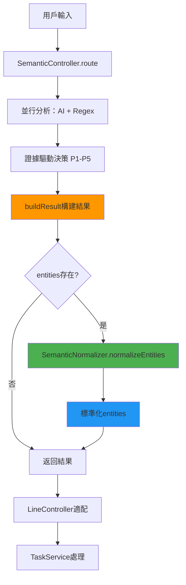

# SemanticController 集成點分析報告

> Task 2.1 執行結果 - SemanticController 與 SemanticNormalizer 集成方案設計

## 📋 當前 SemanticController 輸出格式分析

### 🔍 標準輸出格式

```javascript
// SemanticController.route() 返回格式
{
  final_intent: string,      // 最終決策的Intent（已是英文標準格式）
  source: 'ai' | 'regex' | 'fallback',  // 決策來源
  reason: string,            // 決策理由（中文描述）
  used_rule: 'P1' | 'P2' | 'P3' | 'P4' | 'P5' | 'FALLBACK',  // 使用的決策規則
  confidence: number,        // 信心分數 (0-1)
  entities?: Object,         // 實體信息（可能來自AI或Regex）
  suggestion?: string,       // Fallback時的建議（中文）
  execution_time: string,    // 執行時間 "XXXms"
  debug_info?: {             // Debug模式時的詳細信息
    ai_analysis: AIAnalysisResult,
    regex_analysis: RegexAnalysisResult,  
    decision_path: string[],
    reasoning_details: Object
  }
}
```

### 🔍 LineController 適配層分析

```javascript
// LineController 中的格式適配
analysis = {
  success: true,
  intent: controllerResult.final_intent,     // 已標準化的Intent
  confidence: controllerResult.confidence,
  entities: controllerResult.entities || {}, // 可能未標準化的entities
  method: `semantic_controller_${controllerResult.source}`,
  reasoning: controllerResult.reason,
  used_rule: controllerResult.used_rule,
  execution_time: controllerResult.execution_time,
  debug_info: controllerResult.debug_info
};
```

## 🎯 集成點識別

### ✅ 已標準化的部分
1. **final_intent**: SemanticController已經返回標準英文Intent
2. **整體結構**: 輸出格式已經是系統期望的格式
3. **決策邏輯**: P1-P5證據驅動決策邏輯完全不需要修改

### 🚨 需要標準化的部分
1. **entities**: 來自AI的entities可能包含中文鍵名和值
2. **reason**: 決策理由是中文，但這是給開發者看的，無需標準化
3. **suggestion**: Fallback建議是中文，但這是給用戶看的，無需標準化

## 🔧 集成方案設計

### 🎯 方案1: 在SemanticController內部集成Normalizer（推薦）

**集成點**: SemanticController.buildResult() 方法內部

**集成邏輯**:
```javascript
// 在 buildResult 方法中添加標準化邏輯
buildResult(source, intent, rule, reason, ai, regex, decisionPath, debug, confidence, suggestion = null) {
  const result = {
    final_intent: intent, // intent已經是標準格式，無需處理
    source,
    reason,
    used_rule: rule,
    confidence
  };

  // 🎯 新增：對entities進行標準化
  let rawEntities = null;
  if (source === 'ai' && ai.entities) {
    rawEntities = ai.entities;
  } else if (source === 'regex' && regex.entities) {
    rawEntities = regex.entities;
  }

  if (rawEntities) {
    // 使用SemanticNormalizer標準化entities
    const normalizedEntities = SemanticNormalizer.normalizeEntities(rawEntities);
    result.entities = normalizedEntities.mapped_entities;
    
    // 可選：在debug模式下記錄映射信息
    if (debug && normalizedEntities.key_mappings && Object.keys(normalizedEntities.key_mappings).length > 0) {
      result.debug_info.entity_normalization = {
        key_mappings: normalizedEntities.key_mappings,
        value_mappings: normalizedEntities.value_mappings,
        unmapped_keys: normalizedEntities.unmapped_keys
      };
    }
  }

  // 其他邏輯保持不變...
  return result;
}
```

**優點**:
- ✅ 對外接口完全不變，向後兼容100%
- ✅ 所有調用SemanticController的地方無需修改
- ✅ 集成邏輯集中，易於維護
- ✅ 符合單一職責原則

**缺點**:
- 🟡 SemanticController依賴增加

### 🎯 方案2: 在LineController適配層集成

**集成點**: LineController中的格式適配代碼

**集成邏輯**:
```javascript
// 在LineController中添加標準化
const controllerResult = await SemanticController.analyze(userMessage, conversationContext || {});

// 🎯 新增：標準化entities
let normalizedEntities = controllerResult.entities || {};
if (controllerResult.entities && Object.keys(controllerResult.entities).length > 0) {
  const normalizationResult = SemanticNormalizer.normalizeEntities(controllerResult.entities);
  normalizedEntities = normalizationResult.mapped_entities;
}

analysis = {
  success: true,
  intent: controllerResult.final_intent,
  confidence: controllerResult.confidence,
  entities: normalizedEntities, // 使用標準化後的entities
  // 其他字段保持不變
};
```

**優點**:
- ✅ SemanticController保持純淨，無額外依賴
- ✅ 靈活性高，不同調用方可以選擇是否標準化

**缺點**:
- ❌ 每個調用方都需要自己處理標準化
- ❌ 容易遺漏，不夠系統化
- ❌ 代碼重複

## 🏆 推薦集成方案

**選擇方案1**: 在SemanticController內部集成Normalizer

### 📋 實施計劃

1. **引入依賴**: 在SemanticController中引入SemanticNormalizer
2. **修改buildResult**: 在構建結果時自動標準化entities
3. **保持兼容**: 確保輸出格式完全向後兼容
4. **添加監控**: 在debug模式下記錄標準化過程

### 🔒 兼容性保證

```javascript
// 修改前後的輸出格式對比
// 修改前:
{
  final_intent: "record_course",
  entities: {
    "課程名稱": "數學",
    "學生姓名": "小明",
    "時間": "下午2點"
  }
}

// 修改後:
{
  final_intent: "record_course", // 不變
  entities: {
    "course_name": "數學",        // 標準化的鍵名
    "student_name": "小明",       // 標準化的鍵名
    "time": "下午2點"              // 標準化的鍵名
  }
}
```

### 🚨 風險評估

**風險等級**: 🟢 低風險

**風險因素**:
1. **依賴風險**: SemanticNormalizer載入失敗 → 有fallback機制
2. **性能風險**: 增加標準化處理時間 → 預計<10ms影響
3. **邏輯風險**: 標準化邏輯錯誤 → 有完整測試覆蓋

**緩解措施**:
1. 在標準化過程中添加try-catch保護
2. 標準化失敗時返回原始entities
3. 添加性能監控和日誌記錄

## ✅ 驗收標準

1. **功能性**:
   - ✅ SemanticController輸出格式保持100%向後兼容
   - ✅ entities自動標準化為英文鍵名
   - ✅ 所有現有測試案例通過

2. **性能性**:
   - ✅ 標準化處理時間<10ms
   - ✅ 總體響應時間不超過原來的110%

3. **穩定性**:
   - ✅ 標準化失敗時有fallback保護
   - ✅ 不影響P1-P5決策邏輯的穩定性

## 📊 數據流分析



## 🎯 下一步行動

1. **Task 2.2**: 實現SemanticController與SemanticNormalizer的集成
2. **Task 2.3**: 驗證集成後的功能完整性
3. **Task 2.4**: 更新相關測試案例

---

**📝 執行結果總結**:
- ✅ 完成SemanticController輸出格式分析
- ✅ 確定最佳集成點為buildResult方法內部  
- ✅ 設計了向後兼容的集成方案
- ✅ 風險評估為低風險，有完整的緩解措施
- ✅ 為Task 2.2提供了明確的實施指導

*報告生成時間: 2025-08-01*  
*任務執行者: Claude Code*  
*下一個任務: Task 2.2 - 實現SemanticNormalizer集成*