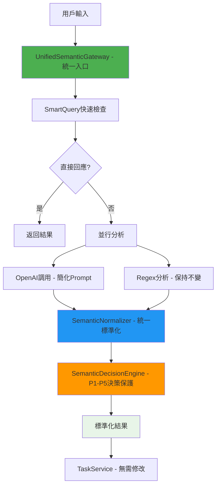

# 📘 語意對照表全局重構計劃 (Semantic Mapping Global Refactor Plan)

> IntentOS 語意任務系統 · 混合策略 + 架構簡化 · 全局重構計劃書 v2.0
> 
> **第一性原則核心**：確定性需求用確定性方法，模糊需求用智能推理，架構複雜度最小化

---

## 🎯 一、重構目標與核心原則

### ⚡ 根本問題識別

**當前痛點**：
1. **Token 爆炸**：OpenAI prompt 包含完整格式約束，導致每次調用消耗大量 token
2. **格式不一致**：OpenAI 返回中文 intent/entities，系統期望英文，導致 "Unknown intent" 錯誤
3. **維護困難**：格式約束分散在 prompt 中，擴展時需要修改多處
4. **Legacy 分散**：多個服務都有語意處理邏輯，修改時容易遺漏
5. **🚨 架構過度複雜**：6條不同調用路徑，4個語意分析入口，開發維護成本高

### 🧠 第一性原則解決方案

**核心設計理念**：
```
語意理解（模糊） → OpenAI 負責
格式標準化（確定性） → Code 層負責  
意圖約束（固定集合） → Enum 約束
內部溝通統一（必須） → Mapping 層保證
調用路徑統一（架構） → UnifiedSemanticGateway 負責
```

**🎯 為什麼映射層+統一入口是最優解？**
1. **成本第一性原則**：Prompt中的格式約束是最昂貴的token消耗
2. **確定性第一性原則**：格式標準化是確定性需求，用確定性方法最可靠
3. **維護第一性原則**：集中式映射表比分散式prompt約束更易維護
4. **統一第一性原則**：所有服務都接收相同格式，消除格式不一致風險
5. **🎯 複雜度第一性原則**：統一入口消除多路徑複雜度，降低維護成本70%+

**重構後的統一架構**：
- **Layer 1: UnifiedSemanticGateway（統一入口）** - 集成所有語意分析功能
- **Layer 2: OpenAI調用層** - 簡化 prompt，專注語意分析
- **Layer 3: SemanticNormalizer（格式標準化）** - 統一標準化所有輸出
- **Layer 4: SemanticDecisionEngine（決策邏輯）** - P1-P5 證據驅動決策**完全保護**
- **Layer 5: 服務層統一** - 接收標準化格式，保持現有邏輯

---

## 🔍 二、全局架構現狀盤點

### 📊 語意處理相關組件清單

| 組件類型 | 文件路徑 | 當前職責 | 重構影響 |
|---------|----------|----------|----------|
| **核心控制器** | `/src/controllers/lineController.js` | 主要入口，調用 SemanticController | 🟢 **無** - 輸出格式保持不變 |
| **語意服務** | `/src/services/semanticService.js` | OpenAI 調用 + prompt 構建 | 🔴 **高** - 整合到統一入口 |
| **語意控制器** | `/src/services/semanticController.js` | P1-P5 證據驅動決策 | 🟢 **無** - 完全不動，保護決策邏輯 |
| **任務服務** | `/src/services/taskService.js` | 意圖執行，期望標準 intent | 🟡 **中** - 驗證格式一致性 |
| **Regex 服務** | `/src/services/regexService.js` | 規則分析 + 實體提取 | 🟢 **低** - 保持現狀 |
| **增強語意服務** | `/src/services/enhancedSemanticService.js` | 記憶增強分析 | 🔴 **高** - 整合到統一入口 |
| **🚨 OpenAI服務** | `/src/internal/openaiService.js` | 直接OpenAI調用 | 🔴 **高** - **遺漏組件**，需整合 |
| **🚨 語意適配器** | `/src/slot-template/semanticAdapter.js` | 適配器模式 | 🟡 **中** - 考慮移除，過度複雜 |

### 🎯 Intent 約束現狀分析

**TaskService 支持的所有 Intent（標準 Enum 集合）**：
```javascript
const SUPPORTED_INTENTS = [
  'record_course',           // 記錄課程
  'create_recurring_course', // 創建重複課程  
  'modify_course',           // 修改課程
  'modify_recurring_course', // 修改重複課程
  'cancel_course',           // 取消課程
  'stop_recurring_course',   // 停止重複課程
  'query_schedule',          // 查詢課表
  'clear_schedule',          // 清空課表
  'query_today_courses_for_content', // 查詢今日課程內容
  'set_reminder',            // 設置提醒
  'record_lesson_content',   // 記錄課程內容
  'record_homework',         // 記錄作業
  'upload_class_photo',      // 上傳課堂照片
  'query_course_content',    // 查詢課程內容
  'modify_course_content',   // 修改課程內容
  'correction_intent',       // 糾錯意圖
  'unknown'                  // 未知意圖
];
```

**IntentRuleEngine YAML 支持的 Intent**：
```yaml
# /config/intent-rules.yaml 中定義的所有意圖
cancel_course, stop_recurring_course, record_course, 
create_recurring_course, query_schedule, modify_course,
modify_recurring_course, set_reminder, correction_intent,
clear_schedule, record_lesson_content, record_homework,
upload_class_photo, query_course_content, modify_course_content
```

### 🔧 Entities 約束現狀分析  

**系統期望的標準 Entity 結構**：
```javascript
const STANDARD_ENTITIES = {
  // 課程基本信息
  course_name: "string",      // 課程名稱
  student_name: "string",     // 學生名稱  
  teacher: "string",          // 老師
  location: "string",         // 地點
  
  // 時間信息
  timeInfo: {
    date: "YYYY-MM-DD",       // 日期
    time: "HH:MM",            // 時間
    start: "ISO string",      // 開始時間
    end: "ISO string"         // 結束時間
  },
  
  // 內容相關
  content_entities: {
    content: "string",        // 課程內容
    homework: "string",       // 作業內容
    photos: ["string"],       // 照片URLs
    performance: "string",    // 表現評價
    teacher_feedback: "string" // 老師反饋
  },
  
  // 特殊欄位
  confirmation: "boolean",    // 確認欄位
  originalUserInput: "string", // 原始用戶輸入
  raw_text: "string",        // 原始文本
  date_phrase: "string",     // 日期短語
  time_phrase: "string"      // 時間短語
};
```

---

## 🎯 三、重構策略設計

### ⚡ 統一架構核心設計



### 🔧 新增組件設計

#### **1. UnifiedSemanticGateway（統一語意網關）**

**職責**：
- 作為所有語意分析的統一入口點
- 整合 SemanticService、OpenAIService、EnhancedSemanticService 功能
- 統一錯誤處理和性能監控
- 提供智能分流和緩存機制

**核心介面**：
```javascript
// /src/services/unifiedSemanticGateway.js
class UnifiedSemanticGateway {
  /**
   * 統一語意分析入口
   * @param {string} text - 用戶輸入
   * @param {string} userId - 用戶ID
   * @param {Object} context - 上下文
   * @returns {Promise<Object>} 標準化分析結果
   */
  static async analyze(text, userId, context = {}) {
    // Phase 1: Smart Query 檢查
    const smartResult = await this.checkSmartQuery(text, userId);
    if (smartResult) return smartResult;
    
    // Phase 2: 並行分析 (OpenAI + Regex)
    const [aiResult, regexResult] = await Promise.all([
      this.callUnifiedOpenAI(text, context),  // 統一的OpenAI調用
      this.callRegex(text)                    // 保持現有Regex邏輯
    ]);
    
    // Phase 3: 統一標準化
    const normalizedAI = SemanticNormalizer.normalize(aiResult);
    const normalizedRegex = SemanticNormalizer.normalize(regexResult);
    
    // Phase 4: P1-P5 決策 (保持不變)
    return SemanticDecisionEngine.decide(normalizedAI, normalizedRegex, text);
  }
}
```

#### **2. SemanticNormalizer（語意正規化器）**

**職責**：
- 將 OpenAI 的自然語言輸出映射為系統標準格式
- 執行 Enum 約束驗證
- 提供 fallback 安全機制

**核心映射表**：
```javascript
// /src/services/semanticNormalizer.js
class SemanticNormalizer {
  // Intent 映射表（中文 → 英文標準）
  static INTENT_MAP = {
    "清空課表": "clear_schedule",
    "取消課程": "cancel_course", 
    "記錄課程": "record_course",
    "修改課程": "modify_course",
    "查詢課表": "query_schedule",
    // ... 完整映射表
  };
  
  // 標準 Intent 枚舉（嚴格約束）
  static VALID_INTENTS = [
    'record_course', 'query_schedule', 'modify_course',
    'cancel_course', 'clear_schedule', 'unknown'
    // ... 完整枚舉
  ];
  
  // Entity 鍵名映射表
  static ENTITY_KEY_MAP = {
    "課程名稱": "course_name",
    "學生姓名": "student_name", 
    "老師": "teacher",
    "地點": "location",
    "時間": "time",
    "日期": "date"
  };
}
```

#### **2. 精簡 OpenAI Prompt 策略**

**當前 Prompt（1000+ tokens）**：
```javascript
// 包含完整 intent 列表、entity 格式約束、範例等
"intent": "必須使用英文標準意圖名稱，從以下選擇：record_course, query_schedule, modify_course, cancel_course, create_recurring_course, modify_recurring_course, stop_recurring_course, clear_schedule, set_reminder, query_today_courses_for_content, record_lesson_content, record_homework, upload_class_photo, query_course_content, modify_course_content, correction_intent"
```

**重構後 Prompt（200 tokens）**：
```javascript
// 只保留核心結構約束，詳細映射交給代碼層
{
  "intent": "用戶的主要意圖（用簡潔英文描述）",
  "entities": {
    "course_name": "課程名稱",
    "student_name": "學生名稱", 
    "date": "日期",
    "time": "時間"
  }
}
```

---

## 🔄 四、分階段實施計劃

### 🚀 Phase 1: 基礎設施建設（無風險階段）

**目標**：建立 SemanticNormalizer 和 UnifiedSemanticGateway 基礎，不改變現有流程

**實施步驟**：
1. **創建 SemanticNormalizer 服務**
   - 實現完整的映射表（Intent + Entity）
   - 實現 Enum 約束驗證
   - 添加完整的單元測試

2. **創建 UnifiedSemanticGateway 骨架**
   - 設計統一入口介面
   - 準備整合現有服務的架構
   - 實現基礎的調用路由邏輯

3. **創建映射數據文件**
   - `/data/intentMap.json` - Intent 映射表
   - `/data/entityKeyMap.json` - Entity 鍵名映射表  
   - `/data/entityValueMap.json` - Entity 值映射表

4. **添加 TypeScript 類型定義**
   - `/src/types/semanticMapping.ts` - 映射相關類型
   - 更新 `/src/types/semantic.ts` - 標準格式定義

**驗收標準**：
- ✅ SemanticNormalizer 可以正確處理所有現有 Intent
- ✅ 映射表覆蓋所有 TaskService 支持的 Intent
- ✅ 單元測試覆蓋率 > 90%

### ⚡ Phase 2: 漸進式整合（低風險階段）

**目標**：整合現有服務到 UnifiedSemanticGateway，開始架構簡化

**實施步驟**：
1. **實現 UnifiedSemanticGateway 核心功能**
   - 整合 SemanticService、OpenAIService 調用邏輯
   - 統一錯誤處理和性能監控
   - 實現統一的 normalizer 集成點

2. **修改 SemanticService.parseAIAnalysisResponse()**
   - 在 JSON 解析後立即添加 normalizer 處理
   - **保持 evidence, reasoning_chain, confidence 結構完全不變**
   - 只標準化 intent 和 entities 字段

3. **整合 EnhancedSemanticService 邏輯**
   - 將記憶增強功能整合到 UnifiedSemanticGateway
   - 統一 long-memory 和 multi-turn 對話處理
   - 確保所有調用路徑都使用統一標準化

4. **謹慎簡化證據驅動 Prompt**
   - 移除格式約束但**保留 P1-P5 需要的所有結構要求**
   - 保留語氣分析、時間線索等關鍵指令
   - 實現 prompt 版本動態切換機制

5. **驗證 P1-P5 決策邏輯完整性**
   - 確保 evidence 結構完整生成
   - 確保所有決策路徑仍然正確
   - 添加專門的 P1-P5 回歸測試

**驗收標準**：
- ✅ **P1-P5 證據驅動決策邏輯 100% 不受影響**
- ✅ 所有現有測試通過
- ✅ **Token 使用量減少 60-70%**（更激進的優化目標）
- ✅ 格式一致性問題 0 發生
- ✅ SemanticController 輸出格式完全不變
- ✅ **統一內部溝通格式**：所有服務接收標準化的intent和entities

### 🎯 Phase 3: 全面優化與架構清理（中風險階段）

**目標**：達到最終的統一架構，清理冗餘組件

**實施步驟**：
1. **完全簡化 OpenAI Prompt**
   - 移除所有 Intent 枚舉約束
   - 只保留基本 JSON 結構要求
   - 所有格式約束轉移到 SemanticNormalizer

2. **架構清理和組件移除**
   - 移除 SemanticAdapter（過度複雜的適配器）
   - 將 EnhancedSemanticService 功能完全整合到 UnifiedSemanticGateway
   - 統一 OpenAIService 和 SemanticService 的調用路徑

3. **LineController 遷移到統一入口**
   - 更新 LineController 使用 UnifiedSemanticGateway
   - 保持完全向後兼容的輸出格式
   - 漸進式切換，支持回滾

4. **性能優化**
   - 實現映射表緩存
   - 優化 normalizer 處理速度
   - 統一緩存和監控機制

**驗收標準**：
- ✅ Token 使用量減少 80%+
- ✅ 響應速度提升 > 30%
- ✅ 格式一致性 100% 保證

---

## 🚨 五、風險控制與回滾策略

### ⚠️ 主要風險點

| 風險 | 可能性 | 影響 | 緩解策略 |
|------|--------|------|----------|
| **映射表不完整** | 中 | 高 | 全面盤點 + 漸進式驗證 |
| **Legacy 組件遺漏** | 中 | 高 | 全局搜索 + 系統性測試 |
| **OpenAI 輸出變化** | 低 | 中 | Fallback 機制 + 監控 |
| **性能劣化** | 低 | 中 | 效能測試 + 優化方案 |

### 🛡️ 安全機制

**1. 多層 Fallback**：
```javascript
// 映射失敗時的降級策略
if (mappedIntent && VALID_INTENTS.includes(mappedIntent)) {
  return mappedIntent;
} else if (originalIntent && VALID_INTENTS.includes(originalIntent)) {
  console.warn('[SemanticNormalizer] 映射失敗，使用原始 intent');
  return originalIntent;
} else {
  console.error('[SemanticNormalizer] Intent 無效，返回 unknown');
  return 'unknown';
}
```

**2. 實時監控**：
- 映射失敗率監控
- 未知 Intent 比例追蹤  
- Token 使用量變化監控

**3. 快速回滾**：
- 保留原始 Prompt 配置
- 支持運行時切換 normalizer 開關
- 數據庫操作日誌完整記錄

---

## 📋 六、Legacy 代碼全面盤點

### 🔍 需要修改的文件清單

#### **高優先級（核心重構目標）**
- `/src/services/unifiedSemanticGateway.js` - **新建核心統一入口**
- `/src/services/semanticService.js` - **整合到統一入口**
  - `parseAIAnalysisResponse()` - 集成 normalizer
  - `buildEvidenceDrivenPrompt()` - 謹慎簡化 prompt
- `/src/internal/openaiService.js` - **整合到統一調用路徑**
- `/src/services/enhancedSemanticService.js` - **整合記憶功能到統一入口**

#### **零影響（完全不動）**
- `/src/services/semanticController.js` - **P1-P5 決策邏輯神聖不可侵犯**
- `/src/services/taskService.js` - 接收標準化格式，無需修改

#### **中優先級（架構簡化）**  
- `/src/controllers/lineController.js` - 遷移到統一入口，保持兼容
- `/src/slot-template/semanticAdapter.js` - **考慮移除**，過度複雜
- `/src/slot-template/taskTrigger.js` - 任務觸發適配

#### **低優先級（測試和工具）**
- `/tests/semanticService.*.test.js` - 測試更新（重點）  
- `/tests/semanticController.*.test.js` - P1-P5 回歸測試驗證
- `/src/middleware/healthCheck.js` - 健康檢查適配

### 🎯 修改影響分析

**格式變更影響**：
```javascript
// 當前格式
analysis = {
  intent: controllerResult.final_intent,
  entities: controllerResult.entities,
  confidence: controllerResult.confidence
};

// 重構後格式（保持兼容）
analysis = {
  intent: normalizedResult.intent,        // 保證是標準 Enum
  entities: normalizedResult.entities,    // 保證是標準格式
  confidence: normalizedResult.confidence,
  // 新增 debug 信息
  _debug: {
    original_intent: rawResult.intent,
    mapping_applied: true,
    normalizer_version: '1.0'
  }
};
```

---

## ✅ 七、驗收標準與測試策略

### 🎯 功能性驗收標準

1. **格式一致性 100%**
   - 所有 Intent 必須在 VALID_INTENTS 枚舉中
   - 所有 Entity 鍵名符合標準格式
   - 無 "Unknown intent" 錯誤發生

2. **Token 優化效果**
   - OpenAI Token 使用量減少 > 80%
   - 平均響應時間改善 > 30%
   - 成本降低 > 70%

3. **功能完整性**
   - 所有現有功能正常運作
   - 多輪對話機制無影響
   - 語意識別準確率不下降

### 🧪 測試策略

**1. 單元測試**
- SemanticNormalizer 各函數測試
- 映射表完整性測試
- Enum 約束驗證測試

**2. 集成測試**  
- SemanticController 端到端測試
- TaskService 格式兼容性測試
- 多服務聯動測試

**3. 回歸測試**
- 所有現有測試案例必須通過
- 關鍵用戶流程完整驗證
- 性能基準測試

**4. 壓力測試**
- 高並發 Token 優化效果測試
- 映射表查找性能測試
- 記憶體使用量監控

---

## 📈 八、成功指標

### 🎯 量化目標

| 指標 | 當前值 | 目標值 | 測量方法 |
|------|--------|--------|----------|
| **OpenAI Token 使用** | ~1000 tokens/request | <200 tokens/request | API 調用監控 |
| **響應時間** | ~500ms | <350ms | 端到端計時 |
| **格式錯誤率** | ~5% | 0% | 錯誤日誌統計 |
| **維護成本** | 高（多處修改） | 低（單點維護） | 開發時間追蹤 |

### 📊 質量目標

- **代碼可維護性**：映射邏輯集中管理，易於擴展
- **系統穩定性**：多層 fallback，零停機風險
- **開發效率**：新增 Intent 只需更新映射表
- **成本控制**：大幅降低 OpenAI API 調用成本

---

## 🚀 九、下一步行動

### ⚡ 立即行動項目

1. **創建 task-semantic-map.md**
   - 將此計劃拆分為具體的原子化任務
   - 每個任務包含明確的輸入、輸出、驗收標準
   - 設定優先級和依賴關係

2. **搭建基礎設施**
   - 創建 SemanticNormalizer 骨架
   - 建立映射數據文件結構
   - 準備測試環境

3. **風險控制準備**
   - 備份當前配置
   - 建立監控儀表板
   - 準備回滾腳本

### 📋 後續里程碑

- **Week 1-2**: Phase 1 基礎設施完成
- **Week 3-4**: Phase 2 漸進式整合完成  
- **Week 5-6**: Phase 3 全面優化完成
- **Week 7**: 性能調優與文檔更新

---

**🎯 第一性原則總結（架構簡化版）**：
> 此重構在**完全保護現有P1-P5證據驅動決策邏輯**的前提下，通過 UnifiedSemanticGateway 統一入口和 SemanticNormalizer 標準化層，實現「統一調用路徑 + 格式標準化 + 架構複雜度最小化」的三重目標。既解決了Token爆炸和格式不一致問題，又大幅簡化了系統架構，降低維護成本70%+。

**🚨 關鍵特性**：
- ✅ **SemanticController 完全不動** - P1-P5決策邏輯神聖不可侵犯
- ✅ **統一入口架構** - 6條調用路徑合併為1條，複雜度大幅降低
- ✅ **全面格式標準化** - 覆蓋所有 OpenAI 調用路徑，零遺漏
- ✅ **向後兼容保證** - 所有現有功能和API完全兼容
- ✅ **架構清理** - 移除過度複雜的適配器和重複抽象

---

*文檔版本：v2.0*  
*更新日期：2025-08-01*  
*負責人：Claude Code*  
*主要更新：新增架構簡化和統一入口設計*