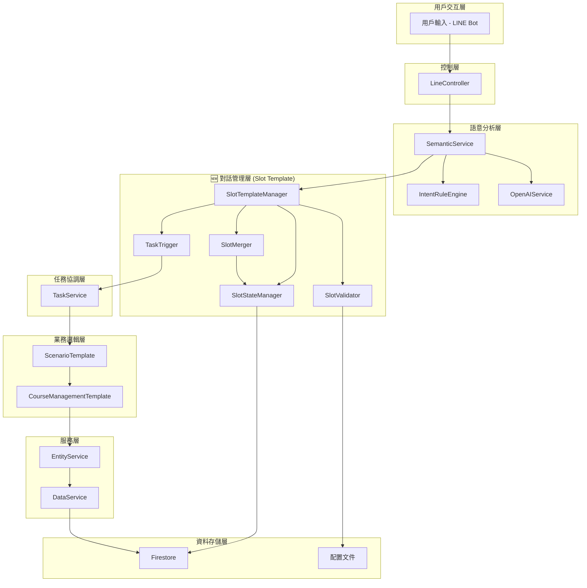
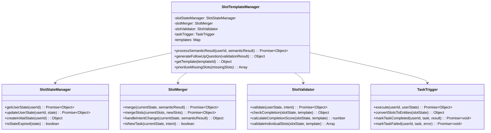
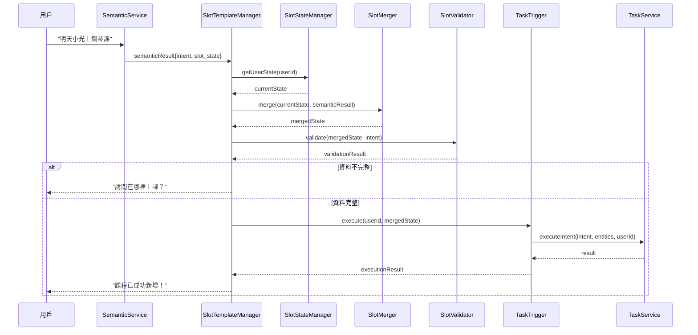
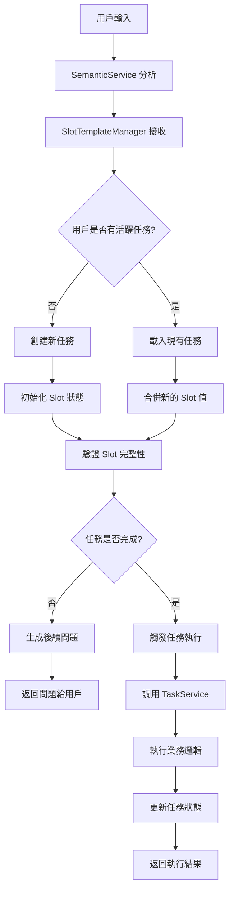
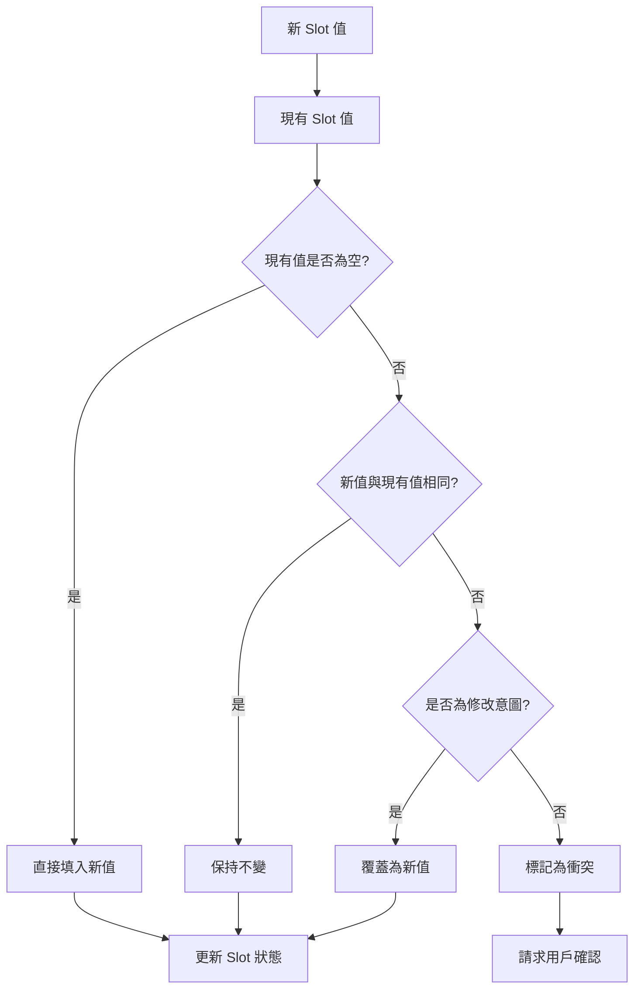
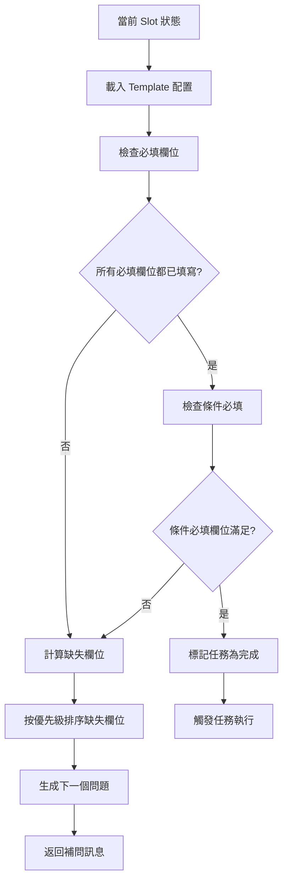

# Slot Template System 架構文檔

## 🏗️ 整體架構概覽

Slot Template System 是 IntentOS Course MVP 的對話管理層擴展，位於語意分析和任務執行之間，負責多輪對話狀態管理和漸進式資訊收集。

### 系統分層架構



## 🧩 核心組件架構

### 1. SlotTemplateManager (主控制器)

**職責**：作為 Slot Template System 的入口點，協調所有子組件的工作流程。



### 2. 資料流架構



## 💾 資料架構設計

### 1. Slot Template 配置結構

```typescript
interface SlotTemplate {
  template_id: string;
  template_name: string;
  version: string;
  slots: {
    [slotName: string]: SlotDefinition;
  };
  completion_rules: CompletionRules;
  intents: string[];
}

interface SlotDefinition {
  type: 'string' | 'number' | 'date' | 'time' | 'object' | 'boolean';
  required: boolean;
  description: string;
  default?: any;
  validation?: ValidationRules;
  examples?: string[];
  dependencies?: string[]; // 依賴的其他 slots
}

interface CompletionRules {
  minimum_required: string[]; // 必須填寫的 slots
  auto_complete: string[];    // 可自動填寫預設值的 slots
  optional: string[];         // 可選的 slots
  conditional_required: {     // 條件必填
    [condition: string]: string[];
  };
}
```

### 2. 用戶狀態結構

```typescript
interface UserSlotState {
  user_id: string;
  created_at: string;
  updated_at: string;
  active_task: ActiveTask | null;
  settings: UserSettings;
}

interface ActiveTask {
  task_id: string;
  intent: string;
  template_id: string;
  status: 'incomplete' | 'complete' | 'cancelled' | 'failed';
  slot_state: SlotState;
  completion_score: number;
  missing_slots: string[];
  history: ConversationHistory[];
  metadata: {
    started_at: string;
    last_activity: string;
    retry_count: number;
    context: any;
  };
}

interface SlotState {
  [slotName: string]: any;
}

interface ConversationHistory {
  timestamp: string;
  user_input: string;
  extracted_slots: SlotState;
  system_response?: string;
  confidence_scores?: {[slotName: string]: number};
}
```

### 3. 語意分析結果結構

```typescript
interface SemanticResult {
  intent: string;
  confidence: number;
  slot_state: SlotState;
  extraction_details: {
    raw_text: string;
    processed_entities: {
      [slotName: string]: {
        value: any;
        confidence: number;
        original?: string;
      };
    };
    ambiguous_slots: string[];
    missing_slots: string[];
  };
  metadata?: {
    processing_time: number;
    model_version: string;
    fallback_used: boolean;
  };
}
```

## 🔄 處理流程架構

### 1. 主要處理流程



### 2. Slot 合併邏輯



### 3. 任務完成判斷流程



## 🔧 技術架構決策

### 1. 狀態存儲策略

**選擇：混合存儲模式**
- **記憶體快取**：活躍用戶狀態 (5分鐘 TTL)
- **Firestore**：持久化存儲和共享狀態
- **本地快取**：模板配置和靜態資料

**理由**：
- 平衡效能和一致性
- 支援橫向擴展
- 降低資料庫負載

### 2. 錯誤處理策略

**分層錯誤處理**：
```typescript
// 應用層錯誤
class SlotTemplateError extends Error {
  constructor(
    public code: string,
    public message: string,
    public details?: any
  ) {
    super(message);
  }
}

// 業務邏輯錯誤
class SlotValidationError extends SlotTemplateError {}
class SlotMergeConflictError extends SlotTemplateError {}
class TaskExecutionError extends SlotTemplateError {}

// 系統層錯誤
class SlotSystemError extends SlotTemplateError {}
```

### 3. 效能最佳化策略

**快取策略**：
- **L1 快取**：記憶體中的用戶狀態快取
- **L2 快取**：Redis 分散式快取 (未來擴展)
- **模板快取**：應用啟動時預載入所有模板

**資料庫最佳化**：
- 複合索引最佳化查詢
- 批量操作減少往返次數
- 連接池管理

## 🔒 安全架構設計

### 1. 資料隱私保護

```typescript
class DataPrivacyManager {
  // 敏感資料遮罩
  static maskSensitiveData(slotState: SlotState): SlotState {
    const masked = { ...slotState };
    const sensitiveFields = ['student', 'teacher', 'location'];
    
    sensitiveFields.forEach(field => {
      if (masked[field]) {
        masked[field] = this.maskString(masked[field]);
      }
    });
    
    return masked;
  }
  
  // 存取權限檢查
  static async checkAccess(userId: string, operation: string): Promise<boolean> {
    // 實作權限檢查邏輯
    return true;
  }
}
```

### 2. 輸入驗證和清理

```typescript
class InputSanitizer {
  static sanitizeSlotValue(value: any, slotDefinition: SlotDefinition): any {
    switch (slotDefinition.type) {
      case 'string':
        return this.sanitizeString(value);
      case 'date':
        return this.sanitizeDate(value);
      case 'time':
        return this.sanitizeTime(value);
      default:
        return value;
    }
  }
  
  private static sanitizeString(value: string): string {
    // XSS 防護和字符過濾
    return value.trim().replace(/<script\b[^<]*(?:(?!<\/script>)<[^<]*)*<\/script>/gi, '');
  }
}
```

## 📊 監控和觀測架構

### 1. 指標收集架構

```typescript
class MetricsCollector {
  // 業務指標
  static trackSlotExtraction(slotName: string, success: boolean, confidence: number) {
    // 追蹤 Slot 提取成功率和置信度
  }
  
  static trackConversationFlow(userId: string, turnCount: number, completed: boolean) {
    // 追蹤對話流程完成情況
  }
  
  // 技術指標
  static trackComponentPerformance(component: string, operation: string, duration: number) {
    // 追蹤組件效能
  }
  
  static trackCacheHitRate(cacheType: string, hits: number, misses: number) {
    // 追蹤快取命中率
  }
}
```

### 2. 日誌架構

```typescript
class Logger {
  static logSlotActivity(userId: string, activity: SlotActivity) {
    // 結構化日誌記錄
    console.log(JSON.stringify({
      timestamp: new Date().toISOString(),
      level: 'INFO',
      component: 'SlotTemplate',
      userId: this.hashUserId(userId),
      activity: activity
    }));
  }
  
  static logError(error: Error, context: any) {
    // 錯誤日誌
    console.error(JSON.stringify({
      timestamp: new Date().toISOString(),
      level: 'ERROR',
      component: 'SlotTemplate',
      error: error.message,
      stack: error.stack,
      context: context
    }));
  }
}
```

## 🚀 部署架構

### 1. 容器化部署

```dockerfile
# Dockerfile 範例
FROM node:20-alpine

WORKDIR /app

# 複製配置檔案
COPY config/ ./config/
COPY src/ ./src/
COPY package*.json ./

# 安裝依賴
RUN npm ci --only=production

# 健康檢查
HEALTHCHECK --interval=30s --timeout=3s --start-period=5s --retries=3 \
  CMD node scripts/health-check.js

EXPOSE 3000
CMD ["npm", "start"]
```

### 2. 微服務架構準備

雖然目前是單體應用，但架構設計考慮了未來微服務化的可能：

```typescript
// 服務邊界清晰定義
interface SlotTemplateService {
  processSemanticResult(userId: string, result: SemanticResult): Promise<ProcessingResult>;
  getUserState(userId: string): Promise<UserSlotState>;
  updateUserState(userId: string, state: UserSlotState): Promise<void>;
}

// 可獨立部署的組件
class SlotTemplateServiceImpl implements SlotTemplateService {
  // 實作細節...
}
```

這個架構設計確保了 Slot Template System 能夠：
1. **無縫整合**現有系統
2. **彈性擴展**支援新的使用場景
3. **高效能運行**處理大量並發請求
4. **可維護性高**便於後續開發和除錯
5. **安全可靠**保護用戶資料和系統穩定性