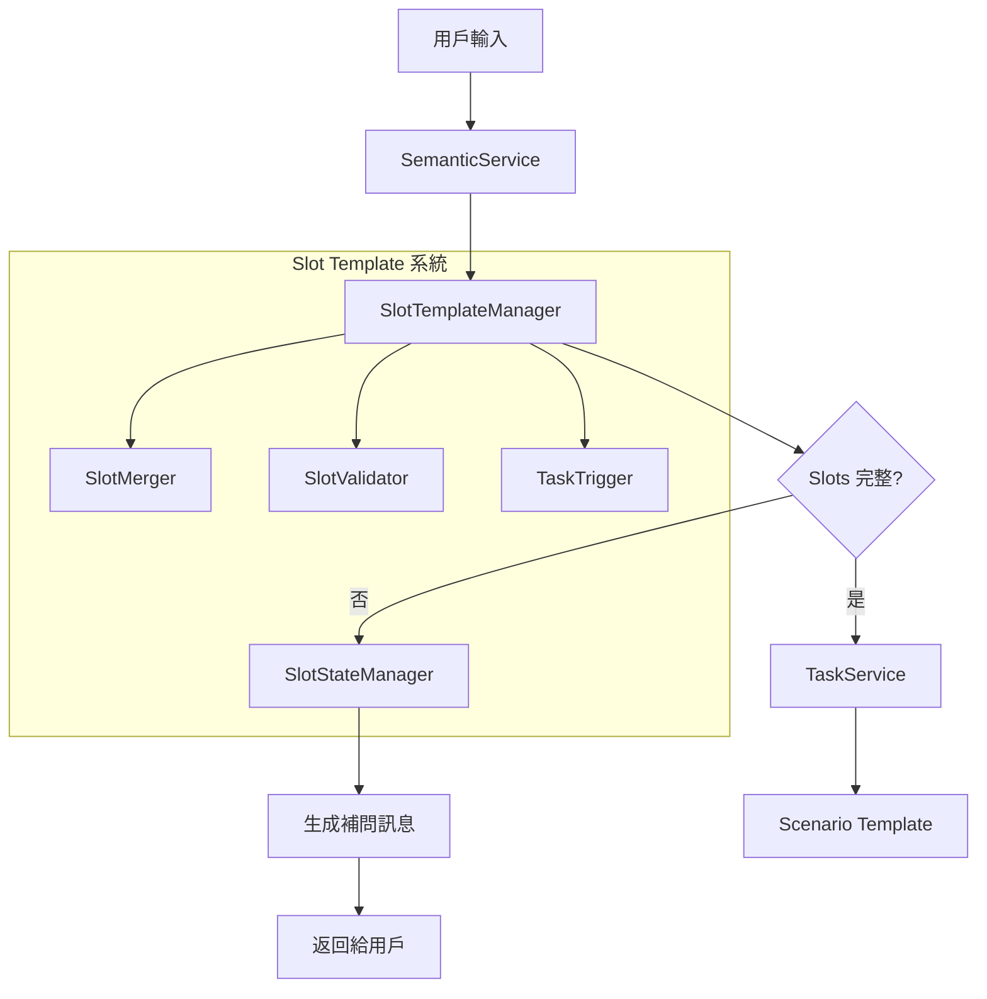
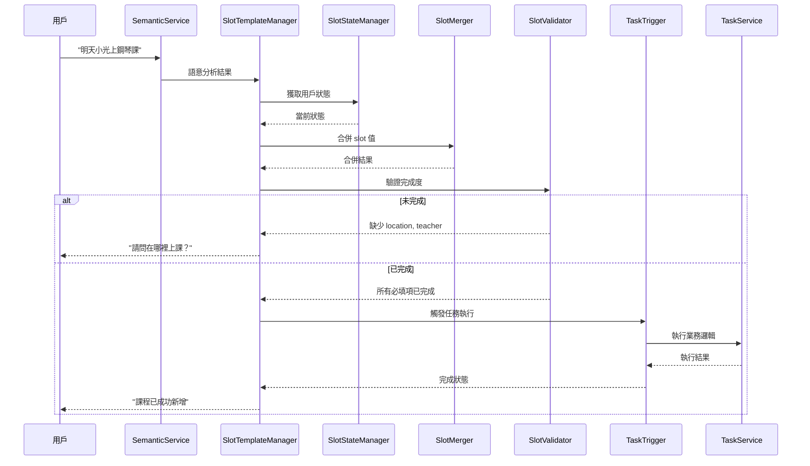

# Slot Template System 技術設計

## 🏗️ 系統架構設計

### 核心組件架構



### 層級架構圖

```
┌─────────────────────────────────────────┐
│                UI Layer                 │
│              (LINE Bot)                 │
└─────────────────┬───────────────────────┘
                  │
┌─────────────────▼───────────────────────┐
│            Controller Layer             │
│           (LineController)              │
└─────────────────┬───────────────────────┘
                  │
┌─────────────────▼───────────────────────┐
│         Semantic Analysis Layer         │
│           (SemanticService)             │
└─────────────────┬───────────────────────┘
                  │
┌─────────────────▼───────────────────────┐
│       🆕 Slot Template Layer            │
│        (SlotTemplateManager)            │
│  ┌─────────────┬─────────────────────┐  │
│  │ SlotState   │ SlotMerger         │  │
│  │ Manager     │                    │  │
│  ├─────────────┼─────────────────────┤  │
│  │ SlotValidator│ TaskTrigger        │  │
│  └─────────────┴─────────────────────┘  │
└─────────────────┬───────────────────────┘
                  │
┌─────────────────▼───────────────────────┐
│            Task Coordination            │
│            (TaskService)                │
└─────────────────┬───────────────────────┘
                  │
┌─────────────────▼───────────────────────┐
│          Business Logic Layer           │
│          (Scenario Template)            │
└─────────────────────────────────────────┘
```

## 📊 資料結構設計

### 1. Slot Template 定義

```javascript
// config/slot-templates/course-management.json
{
  "template_id": "course_management",
  "template_name": "課程管理",
  "version": "1.0.0",
  "slots": {
    "student": {
      "type": "string",
      "required": true,
      "description": "學生姓名",
      "validation": {
        "min_length": 1,
        "max_length": 50
      },
      "examples": ["小光", "小明", "Amy"]
    },
    "course": {
      "type": "string", 
      "required": true,
      "description": "課程名稱",
      "validation": {
        "min_length": 1,
        "max_length": 100
      },
      "examples": ["鋼琴課", "數學課", "英文課"]
    },
    "date": {
      "type": "date",
      "required": true,
      "description": "上課日期",
      "validation": {
        "format": "YYYY-MM-DD",
        "future_only": true
      },
      "examples": ["2025-08-01", "明天", "下週三"]
    },
    "time": {
      "type": "time",
      "required": true,
      "description": "上課時間",
      "validation": {
        "format": "HH:mm",
        "range": ["06:00", "23:00"]
      },
      "examples": ["14:00", "下午兩點", "晚上七點半"]
    },
    "location": {
      "type": "string",
      "required": false,
      "description": "上課地點",
      "default": null,
      "examples": ["板橋教室", "線上", "家裡"]
    },
    "teacher": {
      "type": "string",
      "required": false,
      "description": "授課老師",
      "default": null,
      "examples": ["王老師", "李老師", "Miss Chen"]
    },
    "reminder": {
      "type": "object",
      "required": false,
      "description": "提醒設定",
      "default": {"minutes_before": 10},
      "schema": {
        "minutes_before": "number",
        "custom_message": "string"
      }
    },
    "repeat": {
      "type": "object",
      "required": false,
      "description": "重複設定",
      "default": null,
      "schema": {
        "pattern": "string", // daily, weekly, monthly
        "frequency": "number",
        "end_condition": "object"
      }
    },
    "note": {
      "type": "string",
      "required": false,
      "description": "附註說明",
      "default": null,
      "validation": {
        "max_length": 500
      }
    }
  },
  "completion_rules": {
    "minimum_required": ["student", "course", "date", "time"],
    "auto_complete": ["reminder"],
    "optional": ["location", "teacher", "repeat", "note"]
  },
  "intents": ["record_course", "modify_course"]
}
```

### 2. 用戶對話狀態

```javascript
// 存儲在 Firestore: user_slot_states/{userId}
{
  "user_id": "U123456789",
  "created_at": "2025-07-28T10:00:00Z",
  "updated_at": "2025-07-28T10:05:00Z",
  "active_task": {
    "task_id": "task_20250728_001", 
    "intent": "record_course",
    "template_id": "course_management",
    "status": "incomplete", // incomplete, complete, cancelled
    "slot_state": {
      "student": "小光",
      "course": "鋼琴課", 
      "date": "2025-08-01",
      "time": "14:00",
      "location": null,
      "teacher": null,
      "reminder": {"minutes_before": 10},
      "repeat": null,
      "note": null
    },
    "completion_score": 0.6, // 完成度評分 0.0-1.0
    "missing_slots": ["location", "teacher"],
    "history": [
      {
        "timestamp": "2025-07-28T10:00:00Z",
        "user_input": "明天下午小光要上鋼琴課",
        "extracted_slots": {
          "student": "小光",
          "course": "鋼琴課",
          "date": "2025-08-01", 
          "time": "14:00"
        }
      },
      {
        "timestamp": "2025-07-28T10:02:00Z", 
        "user_input": "在板橋教室",
        "extracted_slots": {
          "location": "板橋教室"
        }
      }
    ]
  },
  "settings": {
    "language": "zh-TW",
    "timeout_minutes": 30,
    "auto_reminder": true
  }
}
```

### 3. Slot 提取結果格式

```javascript
// SemanticService 的輸出格式
{
  "intent": "record_course",
  "confidence": 0.95,
  "slot_state": {
    "student": "小光",
    "course": "鋼琴課",
    "date": "2025-08-01",
    "time": "14:00", 
    "location": null,
    "teacher": null,
    "reminder": null,
    "repeat": null,
    "note": null
  },
  "extraction_details": {
    "raw_text": "明天下午小光要上鋼琴課",
    "processed_entities": {
      "student": {"value": "小光", "confidence": 0.98},
      "course": {"value": "鋼琴課", "confidence": 0.95},
      "date": {"value": "2025-08-01", "confidence": 0.90, "original": "明天"},
      "time": {"value": "14:00", "confidence": 0.85, "original": "下午"}
    },
    "ambiguous_slots": [],
    "missing_slots": ["location", "teacher", "reminder", "repeat", "note"]
  }
}
```

## 🔧 核心組件設計

### 1. SlotTemplateManager (主控制器)

```javascript
class SlotTemplateManager {
  constructor() {
    this.slotStateManager = new SlotStateManager();
    this.slotMerger = new SlotMerger();
    this.slotValidator = new SlotValidator();
    this.taskTrigger = new TaskTrigger();
    this.templates = new Map(); // 緩存模板
  }

  /**
   * 處理語意分析結果，更新用戶狀態
   * @param {string} userId - 用戶ID
   * @param {Object} semanticResult - 語意分析結果
   * @returns {Promise<Object>} 處理結果
   */
  async processSemanticResult(userId, semanticResult) {
    // 1. 載入用戶當前狀態
    const currentState = await this.slotStateManager.getUserState(userId);
    
    // 2. 合併新的 slot 值
    const mergedState = await this.slotMerger.merge(
      currentState, 
      semanticResult
    );
    
    // 3. 驗證合併結果
    const validationResult = await this.slotValidator.validate(
      mergedState, 
      semanticResult.intent
    );
    
    // 4. 更新用戶狀態
    await this.slotStateManager.updateUserState(userId, mergedState);
    
    // 5. 檢查是否可以觸發任務執行
    if (validationResult.isComplete) {
      return await this.taskTrigger.execute(userId, mergedState);
    } else {
      return this.generateFollowUpQuestion(validationResult);
    }
  }

  /**
   * 生成後續問題
   */
  generateFollowUpQuestion(validationResult) {
    const missingSlots = validationResult.missingSlots;
    const template = this.getTemplate(validationResult.templateId);
    
    // 根據缺失的 slot 生成適當的問題
    const nextSlot = this.prioritizeMissingSlots(missingSlots)[0];
    const slotConfig = template.slots[nextSlot];
    
    return {
      success: true,
      type: 'follow_up_question',
      message: this.generateQuestionForSlot(nextSlot, slotConfig),
      slot_state: validationResult.slotState,
      missing_slots: missingSlots,
      completion_score: validationResult.completionScore
    };
  }
}
```

### 2. SlotStateManager (狀態管理)

```javascript
class SlotStateManager {
  constructor() {
    this.dataService = new DataService();
    this.cache = new Map(); // 記憶體快取
  }

  /**
   * 獲取用戶當前狀態
   */
  async getUserState(userId) {
    // 1. 檢查記憶體快取
    if (this.cache.has(userId)) {
      const cached = this.cache.get(userId);
      if (Date.now() - cached.timestamp < 5 * 60 * 1000) { // 5分鐘快取
        return cached.state;
      }
    }

    // 2. 從資料庫載入
    const state = await this.dataService.getDocument('user_slot_states', userId);
    
    // 3. 初始化新用戶
    if (!state) {
      return this.createInitialState(userId);
    }

    // 4. 檢查狀態是否過期
    if (this.isStateExpired(state)) {
      return this.createInitialState(userId);
    }

    // 5. 更新快取
    this.cache.set(userId, {
      state,
      timestamp: Date.now()
    });

    return state;
  }

  /**
   * 更新用戶狀態
   */
  async updateUserState(userId, newState) {
    // 1. 更新時間戳
    newState.updated_at = new Date().toISOString();
    
    // 2. 保存到資料庫
    await this.dataService.setDocument('user_slot_states', userId, newState);
    
    // 3. 更新快取
    this.cache.set(userId, {
      state: newState,
      timestamp: Date.now()
    });

    return newState;
  }

  /**
   * 創建初始狀態
   */
  createInitialState(userId) {
    return {
      user_id: userId,
      created_at: new Date().toISOString(),
      updated_at: new Date().toISOString(),
      active_task: null,
      settings: {
        language: 'zh-TW',
        timeout_minutes: 30,
        auto_reminder: true
      }
    };
  }
}
```

### 3. SlotMerger (狀態合併邏輯)

```javascript
class SlotMerger {
  /**
   * 合併新舊 slot 狀態
   */
  async merge(currentState, semanticResult) {
    const { intent, slot_state: newSlots } = semanticResult;
    
    // 1. 檢查是否為新任務
    if (!currentState.active_task || this.isNewTask(currentState, intent)) {
      return this.createNewTask(currentState, semanticResult);
    }

    // 2. 檢查意圖是否匹配
    if (currentState.active_task.intent !== intent) {
      return this.handleIntentChange(currentState, semanticResult);
    }

    // 3. 合併 slot 值
    const mergedSlots = await this.mergeSlots(
      currentState.active_task.slot_state,
      newSlots
    );

    // 4. 更新任務狀態
    const updatedTask = {
      ...currentState.active_task,
      slot_state: mergedSlots,
      updated_at: new Date().toISOString(),
      history: [
        ...currentState.active_task.history,
        {
          timestamp: new Date().toISOString(),
          user_input: semanticResult.raw_text,
          extracted_slots: newSlots
        }
      ]
    };

    return {
      ...currentState,
      active_task: updatedTask,
      updated_at: new Date().toISOString()
    };
  }

  /**
   * 合併具體的 slot 值
   */
  async mergeSlots(currentSlots, newSlots) {
    const merged = { ...currentSlots };
    
    for (const [slotName, newValue] of Object.entries(newSlots)) {
      if (newValue === null || newValue === undefined) {
        continue; // 跳過空值
      }

      const currentValue = currentSlots[slotName];
      
      if (currentValue === null || currentValue === undefined) {
        // 填充空值
        merged[slotName] = newValue;
      } else if (currentValue !== newValue) {
        // 處理衝突 - 新值覆蓋舊值 (可擴展為用戶確認)
        merged[slotName] = newValue;
      }
    }

    return merged;
  }
}
```

### 4. SlotValidator (驗證和完成度檢查)

```javascript
class SlotValidator {
  constructor() {
    this.templateLoader = new TemplateLoader();
  }

  /**
   * 驗證 slot 狀態和完成度
   */
  async validate(userState, intent) {
    const template = await this.templateLoader.getTemplate(intent);
    const { slot_state } = userState.active_task;
    
    // 1. 驗證個別 slot 值
    const slotValidations = await this.validateIndividualSlots(slot_state, template);
    
    // 2. 檢查完成度
    const completionResult = this.checkCompletion(slot_state, template);
    
    // 3. 計算完成度評分
    const completionScore = this.calculateCompletionScore(slot_state, template);

    return {
      isValid: slotValidations.every(v => v.isValid),
      isComplete: completionResult.isComplete,
      slotState: slot_state,
      missingSlots: completionResult.missingSlots,
      completionScore,
      templateId: template.template_id,
      validationErrors: slotValidations.filter(v => !v.isValid)
    };
  }

  /**
   * 檢查任務完成度
   */
  checkCompletion(slotState, template) {
    const requiredSlots = template.completion_rules.minimum_required;
    const missingSlots = [];

    for (const slotName of requiredSlots) {
      const value = slotState[slotName];
      if (value === null || value === undefined || value === '') {
        missingSlots.push(slotName);
      }
    }

    return {
      isComplete: missingSlots.length === 0,
      missingSlots
    };
  }

  /**
   * 計算完成度評分
   */
  calculateCompletionScore(slotState, template) {
    const allSlots = Object.keys(template.slots);
    const filledSlots = allSlots.filter(slot => {
      const value = slotState[slot];
      return value !== null && value !== undefined && value !== '';
    });

    return filledSlots.length / allSlots.length;
  }
}
```

### 5. TaskTrigger (任務執行觸發)

```javascript
class TaskTrigger {
  constructor() {
    this.taskService = new TaskService();
  }

  /**
   * 執行完整的任務
   */
  async execute(userId, userState) {
    const { active_task } = userState;
    
    try {
      // 1. 轉換為 TaskService 期望的格式
      const entities = this.convertSlotsToEntities(active_task.slot_state);
      
      // 2. 執行任務
      const result = await this.taskService.executeIntent(
        active_task.intent,
        entities,
        userId
      );

      // 3. 更新任務狀態
      if (result.success) {
        await this.markTaskCompleted(userId, active_task, result);
      }

      return {
        ...result,
        type: 'task_execution',
        task_completed: result.success
      };

    } catch (error) {
      // 4. 錯誤處理
      await this.markTaskFailed(userId, active_task, error);
      throw error;
    }
  }

  /**
   * 轉換 slot 格式為 entities 格式
   */
  convertSlotsToEntities(slotState) {
    return {
      course_name: slotState.course,
      student_name: slotState.student,
      teacher: slotState.teacher,
      location: slotState.location,
      timeInfo: {
        date: slotState.date,
        time: slotState.time,
        start: `${slotState.date}T${slotState.time}:00Z`,
        recurring: slotState.repeat
      },
      reminder: slotState.reminder,
      note: slotState.note
    };
  }
}
```

## 🔄 處理流程設計

### 主要處理流程



## 💾 資料存儲設計

### Firestore 集合結構

```
📁 user_slot_states/
  📄 {userId}
    - user_id: string
    - created_at: timestamp
    - updated_at: timestamp
    - active_task: object
    - settings: object

📁 slot_templates/ 
  📄 course_management
    - template_id: string
    - template_name: string
    - version: string
    - slots: object
    - completion_rules: object

📁 slot_execution_logs/
  📄 {logId}
    - user_id: string
    - task_id: string
    - execution_time: timestamp
    - slot_state: object
    - result: object
```

### 索引設計

```javascript
// firestore.indexes.json 新增索引
{
  "indexes": [
    {
      "collectionGroup": "user_slot_states",
      "fields": [
        {"fieldPath": "user_id", "order": "ASCENDING"},
        {"fieldPath": "updated_at", "order": "DESCENDING"}
      ]
    },
    {
      "collectionGroup": "user_slot_states", 
      "fields": [
        {"fieldPath": "active_task.status", "order": "ASCENDING"},
        {"fieldPath": "updated_at", "order": "DESCENDING"}
      ]
    }
  ]
}
```

## 🧪 測試策略

### 單元測試覆蓋

```javascript
// 測試文件結構
tests/
├── unit/
│   ├── slotTemplateManager.test.js
│   ├── slotStateManager.test.js  
│   ├── slotMerger.test.js
│   ├── slotValidator.test.js
│   └── taskTrigger.test.js
├── integration/
│   ├── slotTemplateFlow.test.js
│   ├── multiTurnConversation.test.js
│   └── taskExecution.test.js
└── e2e/
    └── completeUserJourney.test.js
```

### 關鍵測試場景

1. **基本 Slot 填充測試**
2. **多輪對話狀態追蹤測試**  
3. **Slot 衝突處理測試**
4. **任務完成觸發測試**
5. **錯誤恢復測試**
6. **並發用戶測試**
7. **狀態持久化測試**

## 🚀 部署和監控

### 部署策略
- 漸進式部署：先部署 Slot Template 組件，不影響現有流程
- 功能開關：使用 feature flag 控制新舊流程切換
- A/B 測試：小流量驗證用戶體驗改善

### 監控指標
- Slot 提取準確率
- 對話完成率
- 平均對話輪數
- 系統響應時間
- 錯誤率和類型分布